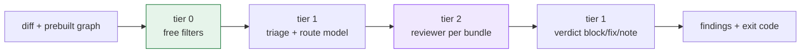

# graph-code-review-agent

A Claude Code plugin that reviews diffs **from a code graph instead of from grep**.

Most high-effort review setups fan out N reviewers over the same diff, and each one
independently greps the repo to discover callers, callees and tests. Those facts get
rediscovered N times, by an LLM, at full token price — and every grep is a serial
round-trip, so it costs wall-clock too.

This plugin computes those facts once, deterministically, for zero tokens.

```
tier 0   path globs, whitespace, lockfiles      free, no model
tier 1   fast classifier scores each bundle     ~$0.0000  per bundle
tier 2   reasoning model, only where earned     the expensive part
```

On a real 26-hunk diff: **13 hunks resolved free**, tier 1 cost **$0.00014** for all
four bundles, and only what survived reached the reasoning model.



## vs. a typical `/code-review` workflow

| | `/code-review` (max effort) | This plugin |
|---|---|---|
| **Architecture** | N dimension agents, each over the full diff, then 3–5 skeptics per finding | Free filters → classifier → one reviewer per package *bundle* → classifier verdict |
| **Finding callers/tests** | Every agent greps and reads, serially, at LLM price | Resolved once from a prebuilt graph; injected as facts, reviewer has no search tool |
| **Model spend** | Top model everywhere | Trivial hunks never reach a model; per-route model tiering is built but **off** until `--cheap-model` is set |
| **Verification** | Every finding re-litigated by 3–5 skeptics | None; one cheap classifier call per finding assigns the verdict |
| **Merge gate** | Depends on the model's wording that run | Fixed-shape record → reproducible `block\|fix\|note` |
| **Setup** | None | graphify + git hook; tier 1 needs no key by default (self-hosted), only if you opt into a hosted vendor |
| **Risk** | Slow, expensive | Stale graph or poor bundling silently costs recall |

The cost and time wins are structural (less redundant work). **The quality claim is
not yet proven** — see [Status](#status). Full diagrams and the cost model:
[docs/architecture.md](docs/architecture.md#11-side-by-side--architecture-usage-optimization).

---

## Requirements

One is a **must**:

| | Why |
|---|---|
| **Claude Code**, logged in | Runs the reviewer on your **subscription** — no `ANTHROPIC_API_KEY` |

Tier-1 triage needs nothing by default: it targets a self-hosted `laya-serve` at
`http://localhost:8000/v1/systemone` out of the box, **no key required**. If
that endpoint isn't actually running, tier 1 degrades to a full review rather
than failing — see "Swapping the classifier" to point it elsewhere, or at the
hosted Jev vendor (which does need `TYPESAFE_API_KEY`).

Then the tooling:

| | Why |
|---|---|
| **Python 3.11+** | `tomllib` is stdlib from 3.11 |
| **`graphify`** on `PATH` | Builds the AST graph (local parse, no tokens) |
| **`git`** | Diffs |

No pip install, no virtualenv — the scripts are stdlib only.

### Check a machine before trusting it

```bash
sh ensure.sh            # macOS / Linux / Git Bash
powershell -ExecutionPolicy Bypass -File ensure.ps1   # Windows
```

Both are thin bootstraps: they locate a Python ≥ 3.11 (printing the exact install
command for your OS if there isn't one) and hand off to `ensure.py`, which checks
everything else. **The shims exist because `ensure.py` cannot check whether Python
is installed — it needs Python to run.**

Output groups checks by priority and, on failure, tells you what to fix first:

```
MUST 1 -- tier-1 access
  [  ok  ] TYPESAFE_API_KEY      not set -- http://localhost:8000/v1/systemone needs no key
MUST 2 -- Claude Code usable
  [  ok  ] claude                2.1.221 (Claude Code)
Required tooling
  [  ok  ] python                3.12.1 (tomllib present)
  ...
Optional
  [  ok  ] tier-1 endpoint       default (http://localhost:8000/v1/systemone, self-hosted, no key needed)
  ...
READY.
```

Point `SYSTEM1_URL` at the hosted Jev vendor instead (see "Swapping the
classifier") and the `TYPESAFE_API_KEY` row becomes a real `FAIL` until one is
set — the gate tracks whichever mode is actually configured, not a fixed
vendor.

Add `--deep` to prove the tier-1 endpoint answers and Claude auth works, rather
than just checking the binaries exist. Exit code is 0 only when every required
check passes, so it gates a provisioning script.

---

## Install

```bash
claude plugin marketplace add liem18112000/graph-code-review-agent
claude plugin install graph-code-review-agent
```

Then in the repo you want to review, once:

```bash
graphify update .          # build the graph
graphify hook install      # keep it current on every commit
```

Nothing else required — tier 1 defaults to a self-hosted `laya-serve`, no key.
If you want the hosted Jev vendor instead, set both:

```bash
echo $SYSTEM1_URL          # set to https://api.typesafe.ai/v1/systemone to opt in
echo $TYPESAFE_API_KEY     # required only if you did
```

---

## Use

**Interactive** — in any repo with a graph:

```
/graph-review
```

**Headless** — CI, a git hook, or a shell:

```bash
git diff origin/main...HEAD > pr.diff

python review.py --diff pr.diff --graph graphify-out/graph.json --repo . > bundles.json
python agent.py  --bundles bundles.json --repo . > findings.json

echo $?   # 1 = blockers found, or a sensitive path needs a human
```

`agent.py` exits non-zero on a blocker **or** an untriaged sensitive path, so it
gates a pipeline as-is.

---

## What it gives the reviewer

Each bundle of related hunks arrives with its graph neighbourhood already resolved:

```json
{
  "id": "b001",
  "package": "src/main/java/com/acme/orders/import",
  "sensitive": true,
  "facts": {
    "entry_point_annotations": ["@ObservesAsync"],
    "symbols": [{"symbol": ".receiveMessage()", "callers": "unknown",
                 "match_precision": "file", "callees": [".handleMessage()"]}],
    "covering_tests": [],
    "in_graph": true
  },
  "hunks": [...]
}
```

The agent is granted `Read` and **no search tool**, deliberately. It is told the
facts are resolved and not to go looking — which is safe only because they really
are resolved.

### `callers: "unknown"` is not zero

On a framework-wired codebase (CDI, Spring, JAX-RS) most methods have **no callers
in a static graph** — measured at 66% on a real Quarkus service. Zero callers there
means *the runtime invokes it*, which is the high-risk case, not the safe one.

So fan-in of zero is reported as `unknown`, never `0`, and entry-point status is
scanned from **source annotations** rather than inferred from graph topology.

---

## Key resolution

**No key by default.** Tier 1 targets a self-hosted `laya-serve` at
`http://localhost:8000/v1/systemone` unless `SYSTEM1_URL` says otherwise.
`TYPESAFE_API_KEY` only matters if you opt into the hosted Jev vendor — then
it's read from the environment first, then from a `.env` beside the scripts,
then (Windows only) the user registry where `setx` writes. A shell `export`
does not survive into CI, a git hook, or another tool's subprocess — the
`.env` fallback exists for exactly those cases.

```bash
# .env  (gitignored — never commit this)
SYSTEM1_URL=https://api.typesafe.ai/v1/systemone
TYPESAFE_API_KEY=...
```

Two failure modes, handled differently on purpose:

| Situation | Behaviour |
|---|---|
| Opted into the hosted Jev vendor, no key — **misconfiguration** | Exit 2 before any work, with the fix in the message |
| Endpoint configured (default or otherwise) but unreachable — **outage** | Degrade and **escalate**; never downgrades a bundle to the cheap tier |

---

## Swapping the classifier

Tier 1 is defined by an HTTP contract, not a vendor. The default needs nothing
running elsewhere to be *correct* — an unreachable default just degrades to a
full review (above) — but for tier 1 to actually triage anything, point
`SYSTEM1_URL` at wherever `laya-serve` actually runs, or at a different vendor:

```bash
SYSTEM1_URL=http://localhost:8000/v1/systemone     # default -- self-hosted, no key
SYSTEM1_URL=https://api.typesafe.ai/v1/systemone   # opt-in -- hosted Jev, needs TYPESAFE_API_KEY
```

The payload is a **compact structural record** — file and symbol names, caller
counts, test counts. **No diff, no source.** A runtime guard in `system1.py` raises
if diff text ever reaches it, which is what makes an external classifier acceptable
against a proprietary codebase.

To stand up the self-hosted side on a blank machine:

```bash
pip install "laya[serve]"
laya-serve                 # listens on :8000, implements the same /v1/systemone contract
```

Nothing else to configure — this *is* the default. `ensure.py` reports which
mode is actually resolved under "tier-1 endpoint"; `review.py` / `agent.py`
only require a key when `SYSTEM1_URL` points at the hosted vendor.

---

## Layout

```
.claude-plugin/     plugin + marketplace manifests
agents/             graph-reviewer.md — the reviewer prompt and tool grant
skills/             graph-review — the interactive orchestrator
review.py           diff -> hunks -> graph facts -> ranked bundles
system1.py          tier-1 client (the swappable slot)
agent.py            headless driver: one `claude -p` per bundle
diffparse.py        unified-diff parsing
rank_queue.py       rank several branches/PRs by aggregate risk (no graphify flag needed)
mcp_server.py       stdio MCP server exposing review_diff / rank_queue to other tools
feedback.py         log + summarise human accept/dismiss per finding
ensure.py           preflight check (.sh / .ps1 shims find Python first)
test_agent.py       self-check: merge-gate fallback, hints_for()
test_review.py      self-check: graph freshness, path-to-sensitive, linter wiring
bench.py            A/B replay harness for measuring against a baseline (+ `selftest`)
overrides.toml      tier-0 globs: sensitive / skip / tests, optional [[linters]]
docs/               architecture.md (why), call-flow.md (what calls what), benchmark.md
```

Every script above also runs `python <script>.py selftest` (or `test_*.py` directly)
with no network, no `defects4j`, and no real `claude -p` call needed.

---

## Measuring it

`bench.py` prepares tasks and scores answers but never invokes a reviewer, so it
stays neutral between arms:

Against your own history — no download, and the arm that actually matters:

```bash
python bench.py prepare-git --repo /path/to/repo     --shas <fix-sha-1>,<fix-sha-2> --out tasks/
python bench.py score --tasks-dir tasks/ --findings-dir out/graph/
```

`prepare-git` diffs each fix commit back to its parent, so the "PR" is the change
that **re-introduces** the bug that commit fixed, and ground truth is what the fix
touched. Build the graph at the fix commit — that is where the hook would have
built it.

It reports `localization_rate`, `mean_findings_per_bug`, and
`mean_rank_of_first_hit` — rank matters because reviews are read top-down. A
missing findings file counts as a **miss**, never a skip, so an arm that crashes
cannot be flattered by its own failure.

---

## Status

Working and measured end to end. Known gaps, stated plainly:

- **The cheap-model tier is built but unexercised.** No bundle in testing has yet
  cleared the confidence floor for the `light` route.
- **The benchmark runs, but the metric does not discriminate.** An A/B over 5
  real fix commits (arm A: same model, no graph facts, free to search; arm B:
  the full pipeline) scored **1.00 localization for both arms** at the default
  ±5 tolerance. Cause: these diffs are 13–28 lines, and ±5 around each
  ground-truth line covers essentially the whole diff, so any finding "hits".
  At ±0 it discriminates but unfairly — a finding one line off a bug is still
  correct — and there the baseline scores *better* (1.00/0.82 vs 0.80/0.64).
  No tolerance is both fair and discriminating for diffs this small.

  The one clear difference the run does show is **volume**: the graph arm
  reported 9.4 findings per bug against the baseline's 4.4. Whether that is
  better recall or more noise is exactly what this metric cannot tell you.

  Fixing it needs one of: Defects4J's minimised bugs (a small bug inside a
  large file), burying the bug-introducing hunk in a realistic multi-file PR so
  localisation is non-trivial, or judging whether a finding *describes* the bug
  rather than whether it lands near the right line. **Until then there is no
  evidence this beats a baseline reviewer.**
- Subscription auth does not travel to hosted CI runners. Works on a dev machine
  or a self-hosted runner where you are logged in.

MIT.
