# Graph-Grounded Review Agent — Architecture

**Goal: beat Claude Code's `/code-review` at max effort on all three axes at once.**

| Axis | Target |
|---|---|
| **Quality** | Equal or better real-bug recall, fewer ungrounded comments |
| **Cost** | Fewer tokens in **system 1** (fast classifier) *and* **system 2** (reasoning LLM), both billed |
| **Time** | Lower wall-clock per PR |

Shaped as **one agent plus one script**, not an orchestration service.

> **Naming.** The *JEV-LLM-Graphify* pattern: **TypeSafe Jev** as system 1, **Claude** as
> system 2, **Graphify** for structure. System 1 is a **swappable slot** behind one HTTP
> contract — **Laya** ([`convaiinnovations/laya`](https://huggingface.co/convaiinnovations/laya))
> can replace Jev later by changing a base URL. See §4.1.

> **Design vs. built.** This document started as a design; the code now exists and
> differs in places. Where it does, the text says **Built:** or **Not built:**.
> The short version:
>
> | Designed | Status |
> |---|---|
> | Tier 0 globs + whitespace filter | **Built** (`review.py`, `overrides.toml`) |
> | Facts from graph, bundled | **Built**, bundled by *package directory* |
> | Tier 1 risk triage + routing | **Built**; routes the model and, with `--gate`, reorders the queue |
> | Tier 1 skips low-risk bundles | **Not built** — every surviving bundle reaches system 2 |
> | Model tiering (cheap model on `light`) | **Built but inert** — `--cheap-model` defaults to `opus` |
> | Tier 1 verdict `block/fix/note` | **Built** (`agent.py adjudicate`) |
> | Separate verifier for suspicious findings | **Not built** |
> | Second independent reviewer on high-risk bundles | **Not built** |
> | System-1 hints passed to the reviewer | **Not built** — the reviewer sees facts only |
> | Graph-freshness check | Manual step in the skill, not enforced in code |

> **Supersedes** the previous revision's §9.5, which argued a flat-rate subscription
> weakened the case for cheap triage. Token cost is now an explicit goal, so triage is a
> first-class lever again — and §4 adds a **free tier beneath it**.

---

## 1. What we are beating

`/code-review` at max effort runs the canonical workflow shape: fan out **N dimension
reviewers** across the diff, then **adversarially verify each finding** with 3–5
independent skeptics, then report.

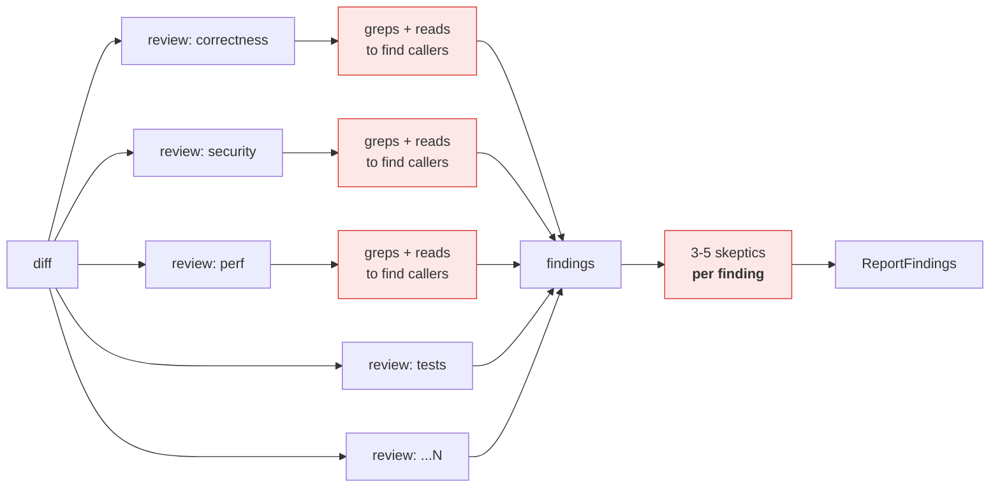

It is a strong baseline. Its costs are structural, and that is what makes them beatable:

**Cost ≈ `D × (S_diff + S_explore)` + `F × V × S_finding`**

| Term | What it is | Why it is waste |
|---|---|---|
| `D × S_explore` | Every dimension agent independently greps and reads to discover callers, callees and tests. | **The dominant hidden cost.** The same structural facts are rediscovered `D` times, by LLM, at full token price — and each grep is a serial round-trip, so it costs wall-clock too. |
| `D × S_diff` | Every dimension sees the whole diff, including the trivial parts. | A formatting hunk is paid for `D` times. |
| `F × V` | Every finding gets 3–5 skeptics. | An obviously-grounded finding is re-litigated as hard as a dubious one. |
| model tier | Max effort runs the top model everywhere. | A rename in a test file does not need the top model. |

Three of those four are addressable without touching recall. The fourth (`D`) is
addressable only if something else supplies the recall — which is §7's argument.

### 1.1 Side by side — architecture, usage, optimization

The same PR through both pipelines. Red is where tokens or wall-clock are spent
rediscovering or re-litigating; green is where this design spends nothing.

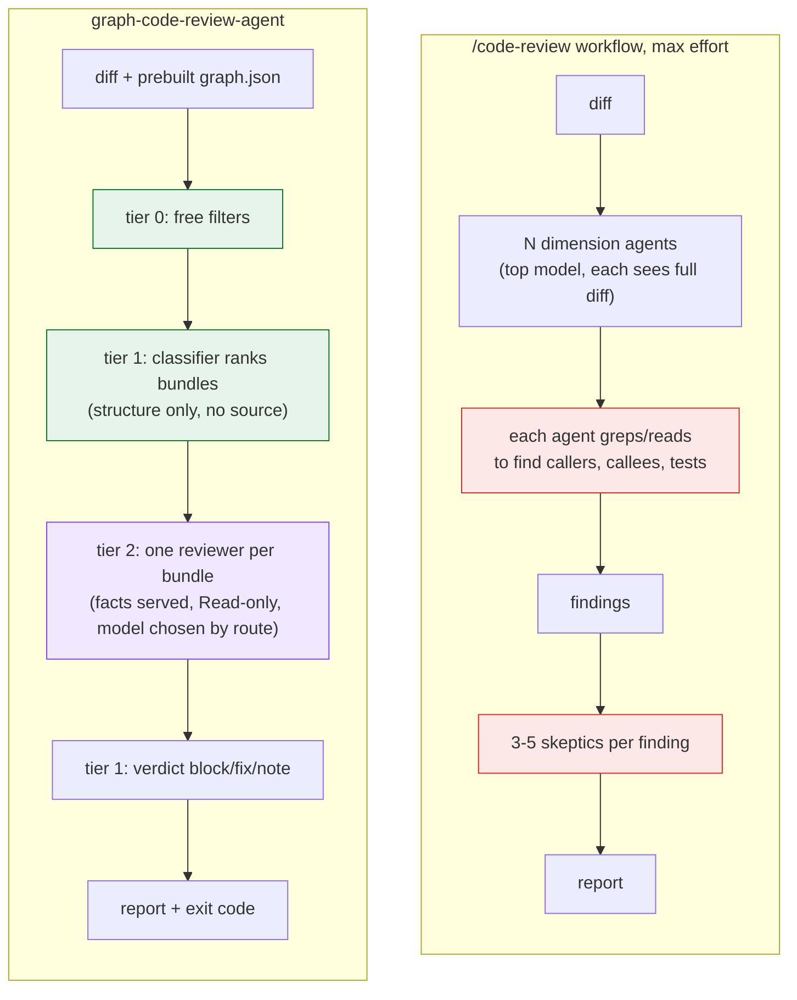

**Where the time goes** — one dimension agent, baseline vs. here:

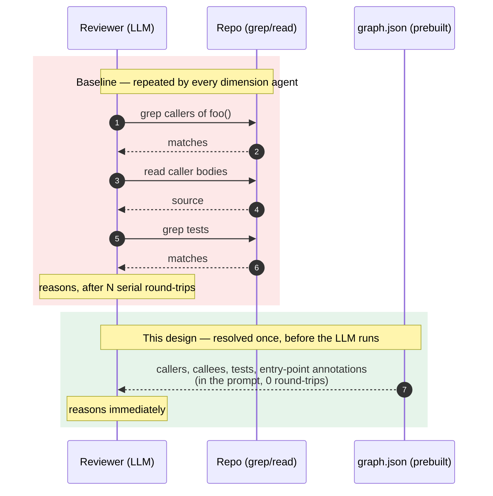

| | `/code-review` workflow (max effort) | graph-code-review-agent |
|---|---|---|
| **Structure discovery** | Each agent greps/reads at LLM price, serially | Graph built by a git hook; facts injected as text |
| **Unit of review** | One agent per *dimension*, each over the whole diff | One agent per *risk bundle* (package-level), all lenses in one call |
| **Trivial hunks** | Paid for by every dimension | Dropped at tier 0 (13 of 26 on the reference run) |
| **Model choice** | Top model everywhere | Route per bundle (`light` / `full` / `human+top`); the cheap model for `light` is **off by default**, so today everything runs `opus` |
| **Verification** | 3–5 skeptics on every finding | None. One tier-1 call (~660 tokens) per finding assigns the verdict; no adversarial re-check |
| **Severity / gate** | Whatever the reasoning model said this run | Fixed-shape record → classifier → reproducible `block\|fix\|note`; exit code follows |
| **Auth / keys** | Claude Code only | Claude Code **plus** `TYPESAFE_API_KEY` for tier 1 |
| **Setup** | None | Install graphify, build graph, install hook |
| **Source confidentiality** | Source goes to Claude | Same for Claude; the *extra* classifier sees structure only |
| **Failure mode** | Slow and expensive | Stale graph or bad bundling silently loses recall |
| **Evidence it is better** | The reference baseline | **None yet** — see README "Status"; cost wins are structural, quality is unproven |

**Optimization map** — which lever removes which cost term:

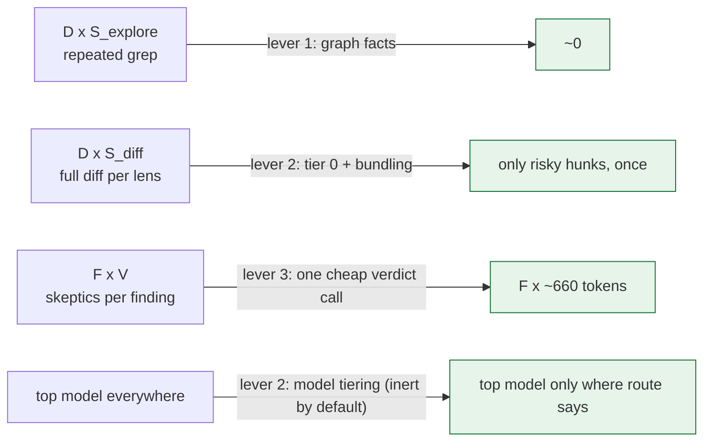

The trade, stated once: this design **adds** a setup step, a second vendor and a
failure mode (stale graph) in exchange for removing redundant work. It does not
claim the baseline is wrong — only that its cost is structural and avoidable.

---

## 2. The three levers

```mermaid
flowchart TD
    subgraph L1["Lever 1 — precompute the facts"]
        A["AST graph built by post-commit hook<br/><b>local parse, zero tokens, off critical path</b>"]
        A --> B["Serve callers, callees, community, tests<br/>as facts in the prompt"]
        B --> C["<b>S_explore collapses to ~0</b><br/>no grep round-trips"]
    end

    subgraph L2["Lever 2 — spend in proportion to risk"]
        D["Free deterministic tier"] --> E["System 1 triage<br/>(routes the model)"] --> F["System 2 on the surviving bundles"]
        F --> G["<b>D and S_diff shrink to the hunks that survive tier 0</b>"]
    end

    subgraph L3["Lever 3 — replace verification with a verdict"]
        H["Tier 1 classifies each finding<br/>instead of 3-5 skeptics re-deriving it"]
        H --> I["<b>V shrinks from 3-5 LLM runs to one ~660-token call</b>"]
    end

    style C fill:#e6f4ea,stroke:#137333
    style G fill:#e6f4ea,stroke:#137333
    style I fill:#e6f4ea,stroke:#137333
```

Levers 2 and 3 cut cost and time with no quality claim attached — they do strictly less
redundant work. Lever 1 is the one that must also *carry* quality, because it is what
justifies reducing `D`. See §7.

---

## 3. Architecture

```mermaid
flowchart LR
    PR["PR diff"] --> S["<b>review.py</b>"]
    HOOK["post-commit hook"] -.->|"graph.json<br/>already built"| S

    S --> T0{"Tier 0<br/>deterministic"}
    T0 -->|"resolved"| DONE["dropped, no model"]
    T0 -->|"survives"| FB["facts + bundles<br/>(by package, max 12 hunks)"]
    FB --> T1["Tier 1 (Jev)<br/>risk + security per bundle"]
    T1 --> RT["route:<br/>light / full / human+top"]

    RT --> T2["<b>agent.py</b> → graph-reviewer<br/>one claude -p per bundle"]
    T2 --> FIND["findings<br/>(scope, severity, confidence)"]
    FIND --> T1B["Tier 1 (Jev)<br/>verdict block / fix / note"]
    T1B --> OUT["findings.json + exit code"]

    style S fill:#e8f0fe,stroke:#4285f4
    style T0 fill:#e6f4ea,stroke:#137333
    style T1 fill:#fef3e8,stroke:#f4a142
    style T1B fill:#fef3e8,stroke:#f4a142
    style T2 fill:#f0e8fe,stroke:#8b42f4
```

Every bundle that survives tier 0 is reviewed by system 2; tier 1's route picks the
model (and, with `--gate`, the order), it does not skip a bundle.

Everything left of `graph-reviewer` costs **zero system-2 tokens**. The graph is built by
a git hook before the PR exists, so it is off the critical path entirely.

End-to-end, as a sequence:

```mermaid
sequenceDiagram
    autonumber
    participant Git as git hook
    participant RV as review.py
    participant S1 as System 1 (Jev)
    participant AG as agent.py
    participant S2 as graph-reviewer (Claude)

    Git->>Git: graphify update (local, 0 tokens)
    Note over Git: graph.json ready before the PR exists
    RV->>RV: parse diff, tier 0 drops skip-glob + whitespace-only hunks
    RV->>RV: map hunks to nodes, attach facts, bundle by package
    loop each bundle
        RV->>S1: structural record (no source)
        S1-->>RV: risk + security + confidence
        RV->>RV: route() = light / full / human+top
    end
    RV-->>AG: bundles.json (ordered by risk_hint; by route with --gate)
    par up to --concurrency bundles
        AG->>S2: claude -p, facts + hunks (Read only, no search)
        S2-->>AG: JSON findings with scope, severity, confidence
    end
    loop each finding
        AG->>S1: flattened finding record
        S1-->>AG: block / fix / note + confidence
    end
    AG-->>AG: clamp pre_existing, fall back if conf < 0.70
    AG-->>AG: exit code (1 = blocker or human needed)
```

Component view — what is code, what is prompt, what is reused:

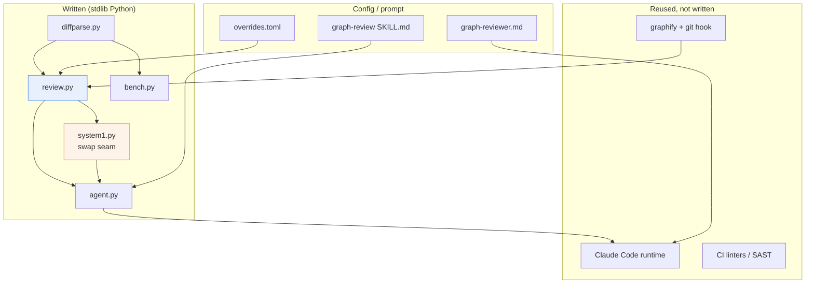

---

## 4. The escalation ladder

Stop at the first rung that resolves the hunk. This is what keeps **both** systems cheap.

| Tier | Mechanism | Token cost | Handles |
|---|---|---|---|
| **0** | `skip` globs and whitespace-only hunks (`review.py`); `sensitive` globs force `human+top` | **zero** | Lockfiles, build output, docs, images, whitespace-only edits. **Built:** linters/SAST are not wired in; they are expected to run in CI beforehand. |
| **1** | Jev over a **compact structural record** — never the hunk (§4.1) | ~$0.042/1M, ~250 ms | Risk class, security surface, and the **route** that picks system 2's model |
| **2** | `graph-reviewer` agent via `claude -p`, one per bundle | **system 2** | Actual reasoning about actual problems |
| **1 again** | Jev over each finding — the verdict (§4.2) | ~660 tokens/finding | What *happens* to what system 2 found |

The ladder runs tier 1 **twice**, once on each side of the reasoning: it picks how
system 2 is run, and then what system 2's output means. System 2 is the only
expensive rung, so it should do nothing but reason.

**Not built:** the original design let tier 1 resolve a bundle with no system-2
call at all ("low risk → done"). In the code a low-risk bundle still gets a
review; it only becomes eligible for the cheap model.

Tier 0 is not a formality. On a typical PR a large share of hunks are generated files,
lockfiles, imports and formatting. Every one resolved for free never reaches either model.

**Model tiering inside tier 2** is a cost lever the baseline does not use. As built
(`system1.route()`, evaluated top-down; every absence of signal escalates):

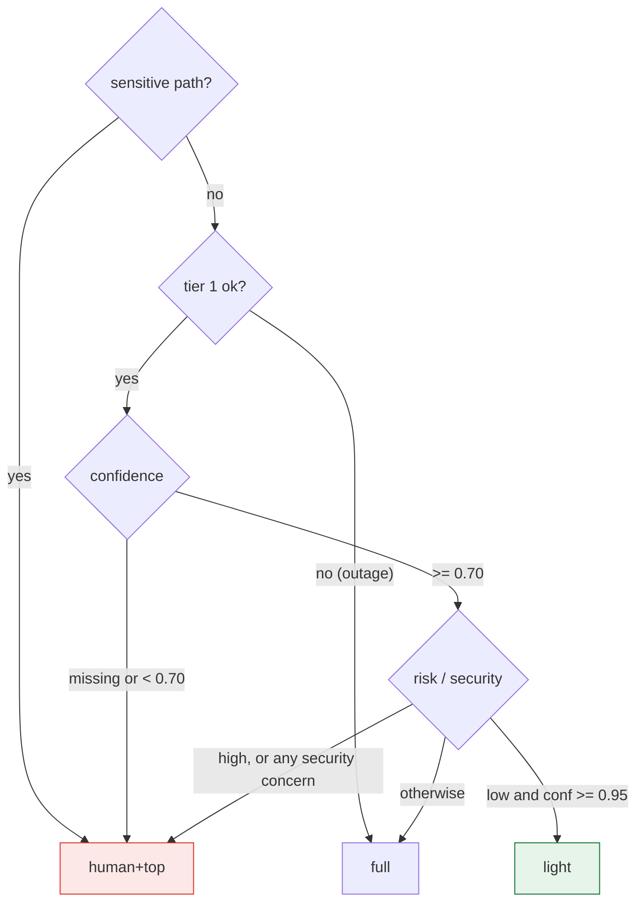

| Route | Model (`agent.py`) | Human |
|---|---|---|
| `human+top` | `opus` | yes — any sensitive bundle makes `agent.py` exit 1 |
| `full` | `opus` | no |
| `light` | `--cheap-model` (default `opus`) | no |

`--cheap-model` defaults to `opus` because the development account cannot reach
`sonnet`, so **the tiering lever is built but inert** until a cheaper model is
configured. `agent.py` prints a note on stderr when `light` bundles ran at full
cost. There is no per-route `effort` setting.

### 4.1 System 1 is a swappable slot

**Today: Jev. Later: Laya. One base URL.**

`laya-serve` implements the same `POST /v1/systemone` request/response shape as TypeSafe
Jev. So tier 1 is defined by **that contract**, not by a vendor:

```bash
SYSTEM1_URL=https://api.typesafe.ai/v1/systemone   # today  - Jev
SYSTEM1_URL=http://localhost:8000/v1/systemone     # later  - laya-serve, self-hosted
```

Nothing else in the design moves. Keep the contract at the boundary and the vendor choice
stays reversible for the cost of an environment variable.

**Why Jev first.** It is usable zero-shot, and Laya is not:

| | Jev 1.13.0 | Laya base |
|---|---|---|
| typed-decisions accuracy | **0.727** | 0.362 *(below the 0.461 majority-class line)* |
| Usable without fine-tuning | **yes** | no — needs a labelled domain set first |
| Options supported | up to 255 | degrades past ~20 |

That removes an entire prerequisite from the critical path. With Laya, tier 1 could not be
switched on until enough labelled PR history existed to fine-tune against. With Jev, tier 1
works as soon as it is wired up — so shadow mode measures a *real* classifier from day one
instead of waiting on a training set.

**What it costs instead:**

| | Jev | Laya |
|---|---|---|
| p50 latency, 1 question | ~236–276 ms | ~33 ms |
| Price | $0.042 / 1M tokens | $0 self-hosted |
| Weights | closed API | Apache 2.0, on-prem |

The latency is the one that bites the **time** goal — roughly 7–8× Laya, on the critical
path, over the network. It is affordable only because tier 0 and bundling keep the *number*
of tier-1 calls small. Budget it explicitly in §10 rather than assuming it disappears.

> **These Jev figures are not verified.** Every one comes from **Laya's own model card** — a
> direct competitor — which states its Jev numbers are third-party published, never measured
> by them, with differing sample sizes and prompts. The card is also internally inconsistent
> on calibration (ECE 0.246 in its headline table, 0.144 in its typed-decisions table).
> Confirm against TypeSafe's own documentation before any of this gates a merge.

**Keep the compact structural record anyway.** It was originally forced by Laya's ~320-token
state budget. Jev's context limit is unknown to us, so it may not be *forced* — but it is
kept, for three reasons that stand on their own:

The record `system1.features()` actually sends (about 70 tokens, one per bundle):

```python
state = {
  "change": "ImportEventOrchestrator.java, ... (6 hunks)",   # file basenames, hunk count
  "package": "src/main/java/com/acme/orders/migration",
  "symbols": ".safeCache(), .receiveMessage()",             # up to 8 labels
  "entry_point": "@ObservesAsync",                           # source annotation scan
  "max_callers": "2",                                        # or "unknown"
  "unknown_callers": 4,
  "covering_tests": 0,
  "sensitive_path": "yes",
  "found_in_graph": "yes",
}
```

Two questions are asked of it, both as `choice` (the one primitive that is correct on
Jev and Laya): *which risk level* (`low | medium | high`) and *which security surface*
(`none | authz | input | secrets`). `tests_missing` and `needs_deep_review` were
dropped: the first is a tier-0 fact, the second is just `risk != low`.
`_no_source()` raises if `@@` or a newline appears in the serialised record, so diff
text cannot reach the vendor even by accident.

Key lookup order is environment, then `.env` beside `system1.py`, then (Windows only)
the user registry where `setx` writes. A custom `SYSTEM1_URL` needs no key.

1. **Confidentiality — the strongest reason.** Jev is a closed external API. This record
   sends *structure*, not source: no diff, no function bodies, no business logic. On a
   proprietary codebase that is the difference between a tolerable dependency and an
   unacceptable one. **Your code never leaves your infrastructure; only its shape does.**
2. **Swappability.** Laya needs ~320 tokens. Design to the tighter constraint now, or
   redesign at swap time.
3. **Latency and price both scale with input size**, and §10 measures both.

It is also the better factoring regardless of vendor: the classifier ranks *structure*, the
LLM reads *code*.

**Deferred until the Laya swap** — do not build these now, but do not lose them:

| Laya constraint | Action at swap time |
|---|---|
| `noul` follows its option labels (#156) | Rewrite every boolean as a two-option `choice` with neutral A/B keys |
| Ordinal `score` is weakest (SST-5 0.372) | Express risk as `choice`, not `score` |
| `act_probability` is anti-correlated (AUROC 0.30) | Gate on confidence (AUROC 0.77) |
| Base is below majority-class zero-shot | Fine-tune on PR history, then fit temperatures (ECE 0.466 → 0.081) |
| Auto-routes long English to a 512-token checkpoint | Pin the checkpoint explicitly |

Whether these apply to Jev is unknown — they are Laya-specific findings. Do not
pre-emptively code around another vendor's bugs.

### 4.2 System 1 also closes the loop — the verdict

System 2 reasons; it does not decide. Once findings exist, each one goes back to
tier 1 as a flattened record (`severity_claimed`, `scope`, `reviewer_confidence`,
`summary`, `failure`, `sensitive_path`) and tier 1 returns `block | fix | note`.
`agent.py adjudicate()` applies that choice, and the exit code follows it. With
`--no-verdict` the reviewer's severity is mapped directly (`blocker→block`,
`should_fix→fix`, `nitpick→note`), using the same fallback and the same clamp.

The reason is drift. A merge gate keyed on whichever adjective a reasoning model
reached for this run is not a gate — rephrase a finding and the build flips. A
cheap classifier over a fixed-shape record is reproducible, costs ~660 tokens per
finding, and is the same primitive already trusted for routing.

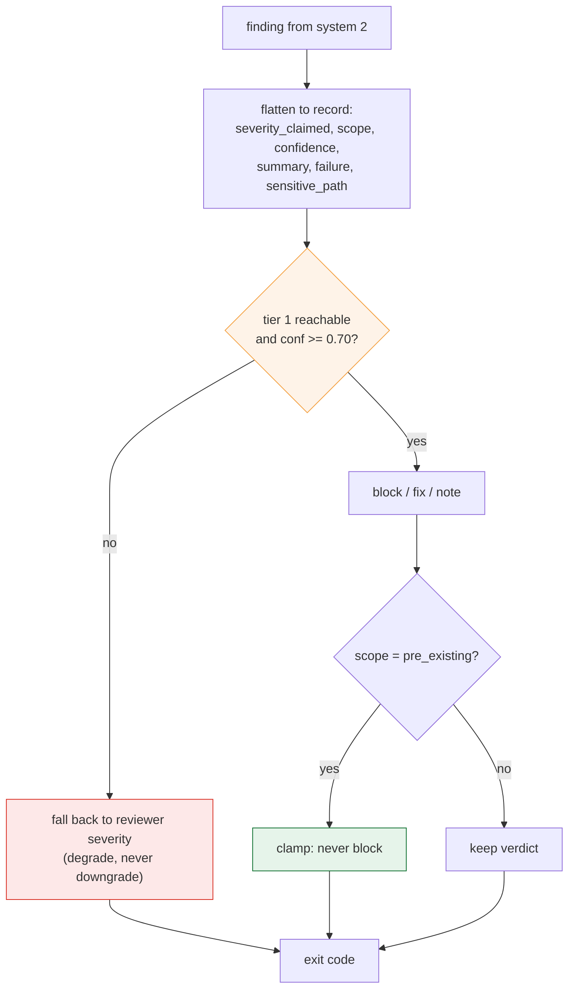

Two rules stay in code, not in the model, because they are already known (§4):

- `scope: pre_existing` is **clamped** to never block, whatever tier 1 says — a
  defect this diff did not cause cannot gate its author's merge.
- Tier 1 down, or confidence < 0.70 → fall back to the reviewer's own severity.
  Degrade, never downgrade (§8).

**Measured limit, worth knowing before you tune it.** Tier 1 is confident
(0.82–1.00) on `note`, which follows from the supplied `scope` field, and
unconfident (0.27–0.72) on `block` vs `fix`, which needs production impact it
cannot see. Three framings were tried, including a `block`/`pass` binary that
scored worse than either. So roughly a third of findings take the fallback by
design. That is the honest boundary of a system-1 slot: it decides what its
record determines, and defers what the record does not.

---

## 5. The agent

`agents/graph-reviewer.md` — a prompt plus a tool grant. About 130 lines; no code.

```markdown
---
name: graph-reviewer
description: Reviews ONE risk-ranked hunk bundle with its graph neighbourhood
             supplied as facts. Does not explore the repository. Returns JSON.
tools: Read
---
```

The body does five things:

1. **Declares the facts resolved.** "Do not go looking for callers, callees or
   tests. They are given." Backed structurally: the agent has `Read` and **no search
   tool**, so the instruction cannot be ignored.
2. **Teaches how to read the facts.** `callers: <n>` is a floor (found edges only);
   `callers: "unknown"` is *unmeasured*, not zero; `entry_point_annotations` come
   from source and mean the runtime invokes the symbol; `match_precision: "file"`
   means the line is unreliable; `in_graph: false` means no structural facts exist;
   `risk_hint` is an ordering prior, to be ignored when forming a judgement.
3. **Lists what to look for.** Correctness, security, concurrency, data access,
   breaking changes, test coverage, and **unneeded complexity the diff introduces**
   (single-implementation interfaces, pass-through wrappers, constant parameters).
   Complexity findings default to `nitpick` and use the same `callers` facts.
4. **Sets rules.** Report everything including uncertain findings (a later step
   ranks and filters); ground every finding in the diff or a fact; no style
   comments; state a concrete failure; set `scope` to `introduced` or
   `pre_existing`, defaulting to `introduced` when unsure.
5. **Fixes the output shape**, a bare JSON array:

```json
{"file": "...", "line": 42,
 "category": "correctness | security | concurrency | data-access | breaking-change | test-coverage | complexity",
 "severity": "blocker | should_fix | nitpick",
 "scope": "introduced | pre_existing",
 "summary": "...", "failure_scenario": "...", "grounded_in": "...",
 "confidence": 0.0}
```

Three things carry the design:

1. **Withholding the search tool** is what kills `S_explore`. It only works because the
   facts are genuinely there — otherwise the agent is blinded, not focused.
2. **Self-scoring in the same call** (`confidence`, `severity`, `scope`) deletes a
   downstream scoring stage. The agent holds the diff and the neighbourhood; a separate
   scorer would see only the comment. Those fields are exactly what tier 1 later
   flattens into the verdict record (§4.2).
3. **The agent sees `id, package, sensitive, facts, hunks` and nothing from tier 1.**
   `agent.py KEYS` excludes `triage` and `route`, so system 1 cannot anchor system 2.
   The original design passed system-1 "hints" as claims to verify; **that was not
   built**, and the isolation is the simpler, safer choice.

---

## 6. The scripts

`review.py` builds the bundles; `agent.py` runs system 2 and applies the verdict.
Everything else is prompt, config or an existing tool.

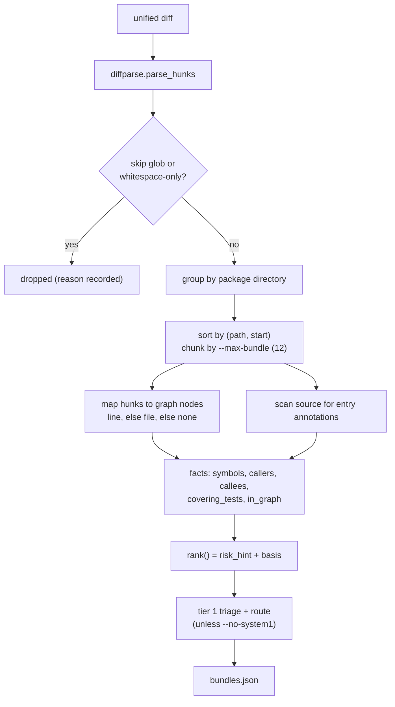

**Bundling matters more than it looks.** Hunks in one package are *one* review with one
shared fact block, not several reviews that each re-derive the same context. A cap of
`--max-bundle` hunks (default 12) bounds the size, because each bundle is one `claude -p`
call that pays its own cold cache write (measured at 24% of subagent tokens), so coarse
beats fine.

`rank()` is a deterministic prior, not a model score: sensitive path +100, entry
point +25, unknown fan-in +10 per kind, max measured fan-in (capped 25), no covering
tests +10, not in graph +5, plus one per hunk. It ships with its basis string so the
ordering is explainable.

Output is plain JSON on stdout. No service, no queue, no DB.

---

## 7. The quality thesis

Cost and time wins are structural. **Quality is the claim that has to be argued and then
measured**, because lever 1 reduces `D`, and `D` is the baseline's recall mechanism.

> **Claim: recall comes from context, not from lens count.**

The baseline's reviewers are context-starved. They see the diff and must *choose* to go
looking for consequences, then pay per grep to do it — so in practice they often do not,
and the dominant miss category in real review is exactly that: **cross-file consequences
of a local-looking change**. Adding a seventh adjective to the lens list does not fix it.

A reviewer told *"this function has 14 callers, 3 in the auth community, covered by these
2 tests, and it is a `@ObservesAsync` entry point"* is working from the information that
actually finds those bugs.

So the trade is: **fewer agents, each much better informed.** Where lens diversity still
earns its keep — high-risk bundles, where disagreement is itself the signal — the
intended fix is a second independent reviewer. **Not built:** today every bundle gets
exactly one reviewer.

**This is a hypothesis with a clear failure mode**: if bundle-level review with facts has
worse recall than dimension fan-out, the benchmark in §10 will show it, and the fix is to
restore lens fan-out *on high-risk bundles only* — keeping the cost win everywhere else.

---

## 8. Guardrails

Each guardrail is marked with where it lives.

- **Hard overrides.** *Built.* `[sensitive]` globs in `overrides.toml` set
  `bundle.sensitive`; `route()` returns `human+top` regardless of any score, and
  `agent.py` exits 1 while any sensitive bundle exists. Path globs, no model.
- **Found edges only.** *Built* in `Graph.__init__`: non-`EXTRACTED` edges are skipped
  entirely. They are not currently passed to system 2 as soft hints either.
- **No zero-means-safe.** *Built.* Fan-in 0 is emitted as `"unknown"` (`review.py`);
  tier-1 outage routes to `full`; low confidence routes to `human+top`; a missing key
  fails loudly (exit 2) instead of silently skipping triage.
- **Degrade, never downgrade.** *Built.* Tier 1 down or confidence < 0.70 on a verdict
  falls back to the reviewer's own severity.
- **Graph freshness.** *Not enforced in code.* The `graph-review` skill instructs the
  user to check the graph post-dates the base commit; `review.py` only checks that the
  file exists. A stale graph silently demotes matches from line to file precision.
- **Deterministic stays deterministic.** *Partly built.* Skip-globs and whitespace-only
  hunks never reach a model. Linters, CVE and SAST checks are assumed to run in CI.
- **Feedback loop.** *Not built.* Logging accept/dismiss per comment is still the only
  honest source of a quality number, and the only thing that would calibrate tier 1.

---

## 9. Measured constraints

Measured on a real Quarkus service (`acme-orders`, graphify 0.9.27, 8031 nodes / 30573 edges).
**Constraints, not caveats** — §6 has to honour all of them.

### 9.1 Hunk → node mapping is lossy by construction

- `source_file` points into a **build-time staging copy**, not the working tree → needs a prefix rewrite.
- `source_location` is a **single start line** (`L30`), never a range, and is **absent on 36%** of nodes → the match is approximate; fall back to the file node and mark low precision.
- `metadata` is populated on **2 of 8031** nodes → no language or kind field; methods are identified by a leading `.` in the label.

### 9.2 `fan_in` is inverted on CDI-wired services

```
java method nodes:         3907
  fan-in 0:                2586   = 66.2%
REST / controller methods:   86
  fan-in 0:                  57   = 66.3%
```

```java
// EventLogController.java:43 — fan-in 0 in the graph,
// invoked on every audit event in production
public void onAuditEvent(@ObservesAsync AuditEvent event) {
```

`@Inject` in **117** files, `@Path` 28, `@Produces` 24, `@Observes` 18. `fan_in: 0`
disproportionately means **framework entry point** — the high-risk case. Emit `unknown`,
and derive entry-point status from **annotations scanned in source**, not from topology.
The annotation scan is tier 0: free, and it is what makes the fact block trustworthy
enough for §5's "do not grep" instruction to be safe.

### 9.3 `path_to_sensitive` is noise as specified

`graphify path` walks all relation types, undirected, through test files:

```
EventLogController <--contains-- EventLogController.java --imports--> Constants
  <--imports-- QueryBuilderTest.java --imports--> JsonObject
```

Restrict to **directed `calls` edges**, exclude tests, cap length — or drop the feature.

### 9.4 What works

`EXTRACTED` 24457 / `INFERRED` 6116 (80/20) — the found-vs-inferred guardrail is
implementable exactly as written. Relations: `calls` 9224, `references` 8819,
`imports` 7743, `method` 3907, `contains` 643, `inherits` 119, `implements` 65.

### 9.5 Capabilities that do not exist

`graphify prs --triage` is not a command in 0.9.27; queue-level PR ranking must be built or
dropped. There is no MCP server mode — `graphify install` copies a *skill*.

---

## 10. Proving it — the benchmark harness

**"Outperforms" is not a design property. It is a measurement**, and without this section
the rest of the document is a hypothesis.

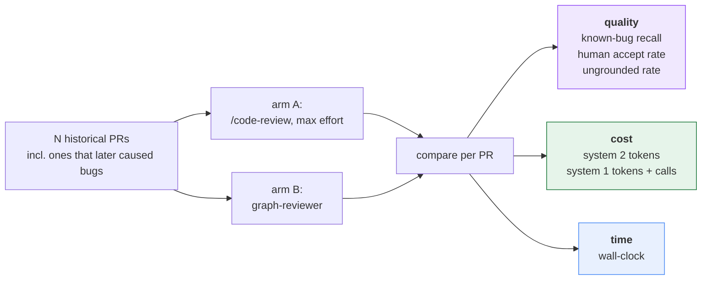

| Metric | Definition | Honest expectation |
|---|---|---|
| **Known-bug recall** | Of PRs that later caused a bug, how many did the arm flag at the right place? | The number that decides it. Must be **≥** baseline. |
| **Human accept rate** | Comments accepted vs dismissed | Should rise — grounded facts reduce speculation |
| **Ungrounded rate** | Comments not supported by diff or facts | Should fall |
| **System 2 tokens** | Billed reasoning tokens | Structural win — strictly less redundant work |
| **System 1 cost** | Jev tokens + call count + added p50 latency | Cheap per call (~$0.042/1M) but **~250 ms each on the critical path** — tier 0 and bundling must keep the call count low, or this eats the time win |
| **Wall-clock** | PR open → review posted | Structural win — no grep round-trips, no barriers, graph prebuilt |

**`bench.py` is not optional and not last.** Build it at step 2 of §11 and run every stage
against it, or the cost wins get spent on quality losses nobody measured.

### 10.1 Which public benchmark

**SWE-bench is the wrong shape.** It measures *patch generation* — given an issue,
produce a patch that passes hidden tests. This agent never generates a patch; it reads a
diff and finds defects. Scoring it on SWE-bench measures a capability we do not ship.

**The filter that eliminates most of the field: repo-level, not snippet-level.** Lever 1
is the whole design — callers, callees, communities and tests served as facts. A
function-level dataset has no repository to index, so Graphify has nothing to build a
graph from and **lever 1 becomes untestable by construction**. That rules out Devign,
BigVul, DiverseVul and PrimeVul. They are fine for a vulnerability classifier; they cannot
evaluate a graph-grounded reviewer.

**Primary: Defects4J, inverted.** Java — matching `acme-orders` and every measurement in §9 —
repo-level, and each bug ships a triggering test, so ground truth is *executable* rather
than annotated opinion.

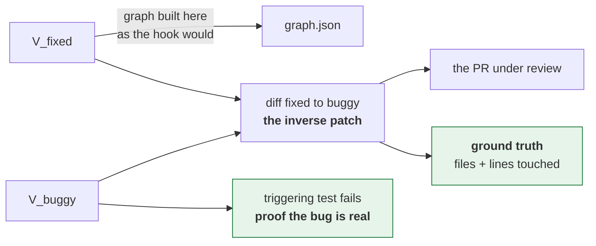

Defects4J holds `V_buggy` and `V_fixed` differing **only in source** — the test suite is
held constant — so diffing fixed→buggy yields a clean bug-introducing change with no test
noise mixed in.

**One benchmark per tier.** They measure different claims and no single corpus covers all:

| Stage | Benchmark | Question it answers |
|---|---|---|
| Step 5 decision point | **Defects4J**, inverted | Does graph-grounded bundle review out-recall dimension fan-out? |
| Tier 1 shadow mode | **ApacheJIT** (SZZ-labelled Apache Java commits) | Can structural features rank risk at all? |
| Tier 0 | **OWASP Benchmark** (Java, seeded CWEs) | What do linters and SAST already cover for free? |
| Cost + time, decisive | **Own PR history** | Everything else in §10 |

**Defects4J validates the quality hypothesis but not the cost hypothesis.** Its bugs are
*minimised* — usually a single hunk. A one-hunk PR never exercises tier 0 filtering, never
exercises community bundling, and gives triage nothing to rank. So it settles §7 and says
**nothing** about levers 2 and 3, which is where the token and time wins live. Cost and
time need realistic, noisy PRs: generated files, lockfiles, formatting, twelve hunks across
four communities. That is own history. **This is why §10 stays primary and §10.1 is
supplementary.**

Two further caveats:

- **Contamination.** Defects4J and SWE-bench are old and near-certainly in training data; a
  model may *recall* a famous bug rather than find it. Control with a recent-only set —
  GitBug-Java exists for this reason — or with own recent PRs.
- **A reversed fix is not a real bug-introducing commit.** Removing a null check reads as
  obviously wrong in a way real bugs rarely do, which inflates recall. ApacheJIT's
  SZZ-derived commits are *real* bug-inducing changes and do not have this artefact — a
  second reason to run both.

> **Dataset sizes are unverified.** Web lookup was unavailable when this section was
> written, so all counts (Defects4J ~835 bugs / 17 projects, SWE-bench Verified 500,
> ApacheJIT ~106k commits, OWASP ~2 740 cases, GitBug-Java ~199) are from memory. Confirm
> at source before citing.

**Running it:**

```bash
python bench.py prepare --bugs Lang:1,Math:5 --out tasks/     # needs defects4j on PATH
python bench.py prepare-git --repo . --shas <fix-sha>,... --out tasks/   # own history, no download
# ... run each arm, emit <bug>.json per task ...
python bench.py score --tasks-dir tasks/ --findings-dir out/graph/ --tolerance 5
python bench.py score --tasks-dir tasks/ --findings-dir out/baseline/ --tolerance 5
```

`prepare-git` is the cheap path and has been run (5 fix commits). It saturated; see
[benchmark.md](benchmark.md) for why, and always sweep `--tolerance`.

`bench.py` does **not** invoke the arms. It prepares tasks and grades answers, so it stays
neutral between them and runnable on its own. Metrics it reports per arm:
`localization_rate`, `mean_findings_per_bug` (noise), `precision_proxy`, and
`mean_rank_of_first_hit` — rank matters because reviews are read top-down, so a hit buried
under nine false positives is worth less than one at the top. A missing findings file
counts as a **miss**, never a skip, so an arm that crashes on a bug cannot be flattered by
its own failure.

---

## 11. Build order and file manifest

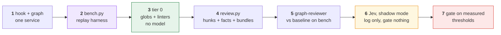

**Choosing Jev deletes a step.** The Laya variant needed a fine-tune-and-calibrate stage
between shadow mode and gating, because its base checkpoint scores below the majority-class
baseline (§4.1). Jev is usable zero-shot, so step 6 measures a real classifier immediately.

Thresholds still have to be set from replayed history at step 7 — that is threshold
calibration, not model training, and it is required whichever vendor fills the slot.

Step 5 is the real decision point: **graph-grounded bundle review against the baseline,
before any of the triage machinery exists.** If lever 1 does not hold quality on its own,
levers 2 and 3 are just a cheaper way to be worse, and you want to know that at step 5
rather than step 7.

| File | Lines | Purpose |
|---|---|---|
| `review.py` | 260 | diff → hunks → facts → bundles → tier-1 triage → ranked JSON |
| `agent.py` | 217 | bundles → one `claude -p` per bundle → findings → tier-1 verdict → exit code |
| `system1.py` | 232 | `POST /v1/systemone` client, questions, `route()`. The swap seam (§4.1). |
| `diffparse.py` | 73 | Unified-diff parsing, shared by review + bench |
| `bench.py` | 190 | Task prep (Defects4J, git history) + localization scoring (§10.1) |
| `ensure.py` (+ `.sh`, `.ps1`) | 229 | Preflight: key, `claude`, Python, `graphify`, `git`; `--deep` probes live |
| `test_agent.py` | 40 | Self-check for the merge-gate fallback logic |
| `agents/graph-reviewer.md` | 130 | The agent. Prompt and `tools: Read`, not program. |
| `skills/graph-review/SKILL.md` | 103 | Interactive entry: check graph, run `review.py`, run `agent.py`, report |
| `overrides.toml` | 36 | Tier-0 sensitive / skip / test globs |
| `setup-defects4j.sh` | 65 | One-time benchmark toolchain install |

Line counts are as of the 0.2.0 tree. The only runnable self-check is
`test_agent.py`, covering the merge-gate fallback; `bench.py` has no `selftest`.

### Built, with deviations from this document

1. **Bundling is by package directory, not Graphify community.** The real graph
   ships no community data — `hyperedges` is empty and clustering was never run.
   For Java the package *is* the module boundary, so this is free, deterministic
   and drops a dependency on an optional Graphify feature.
2. **The agent gets `tools: Read` and no search tool.** The first design stated
   "do not grep" as an instruction; withholding the tool enforces it structurally.
3. **System 2 runs through `claude -p`, one subprocess per bundle**, on the
   subscription, not an API key. The only API key in the system is the tier-1 one.
4. **Tier 1 adjudicates, it does not gate or verify.** It routes the model and
   assigns a verdict. There is no "skip the bundle" path and no verifier stage.
5. **No hints to the reviewer.** `triage`/`route` are not part of the agent's input.
6. **Graph edges: both key names.** `graphify update --no-cluster` writes `links`,
   clustered graphs write `edges`; `Graph` reads either. Reading only one yields a
   graph with every node and no relationships, with no error.

### What the first real run showed

`acme-orders` commit `a1b2c3d4e`, against the live 23 MB graph, **0.5 s**:

```
26 hunks -> 13 resolved free at tier 0 (50%) -> 4 bundles
b001  153  sensitive  Migration{EventOrchestrator,MessageReceiver}.java
b002  124  sensitive  ImportMessageReceiver.java
b000   16             LayeredCache.java
b003    7             LockExecution.java, Mutex.java   (new package, not in graph)
```

The top bundle's basis reads `sensitive path (+100); entry point @ObservesAsync
(+25); 4 symbol(s) with unknown fan-in (+10)`. That is **§9.2 happening live**: a
CDI async observer the graph cannot see callers for. A naive `fan_in: 0` would
have ranked it as dead code; the source annotation scan makes it the top item.

Three defects surfaced only because the run used a real repo and a real graph:

- **`covering_tests` was structurally always empty.** Test→source edges land on
  the *class* node (`FooIT -references-> Foo`), never the method node, so a
  per-symbol lookup found nothing and reported "no tests" for well-covered
  classes — while adding a constant +10 to every bundle. Now resolved at file level.
- **A 226-line `DESIGN.md` outranked all real code**, having inherited the
  sensitive flag from its directory. Docs now resolve at tier 0; that is most of
  the 50% drop rate.
- **`is_whitespace_only` caught only reindentation.** Fixed, with a
  string-literal guard — collapsing whitespace inside `"a  b"` would silently
  drop a real change.

Tier-1 degradation is verified: with the endpoint unreachable `review.py` exits 0,
reports `system1_ok: 0/4`, and routes every bundle to `full` or `human+top`.
**Nothing downgrades to `light` on failure.**

Reused instead of written: the graph (graphify + its git hook), linters and SAST already in
CI, the agent runtime, `ReportFindings`.

---

## 12. Open questions

- **Does lever 1 hold quality alone?** §7 is a hypothesis. Step 5 settles it — and it is the
  one that decides whether any of this beats the baseline.
- **Is structural-features-only enough signal to rank risk?** §4.1 keeps the hunk out of the
  state. Defensible in principle (the classifier ranks structure, the LLM reads code) but
  untested. If ranking is weak, the next move is a *tier-0 summary line* of the hunk — not
  the raw hunk, which would forfeit the confidentiality property.
- **Jev's real numbers.** Every Jev figure in §4.1 comes from a competitor's model card,
  self-declared as third-party and unmeasured, and internally inconsistent on ECE
  (0.246 vs 0.144). Confirm accuracy, calibration, **context limit** and rate limits against
  TypeSafe's own documentation before step 6.
- **Is an external API acceptable for this codebase?** Jev is closed and off-premise. The
  feature record means source never leaves — but file and symbol names still do. If that is
  ruled out, the slot (§4.1) is exactly what lets self-hosted Laya take over, at the price
  of the fine-tune prerequisite.
- **Does ~250 ms × N calls fit the time budget?** The wall-clock goal assumes tier 0 and
  bundling keep tier-1 call volume low. Measure it at step 6; if it dominates, batch the
  calls or move ranking to tier 0 heuristics.
- **Bundling granularity.** Package-level with a `--max-bundle 12` cap, chosen to amortise
  the per-call cache write. Untuned against recall; the bench has not yet been able to
  discriminate (benchmark.md).
- **Is a verifier needed after all?** Lever 3 was redesigned from "verify suspicious
  findings" to "classify every finding cheaply". Nothing re-checks a finding's truth, so a
  confident false positive from system 2 passes straight to the verdict.
- **When does the cheap model turn on?** The `light` route needs confidence ≥ 0.95 and
  risk `low`; no bundle has cleared it yet, and the account cannot reach a cheaper model.
- **Target service.** §9 measures `acme-orders`. A non-CDI codebase changes §9.2 substantially.
