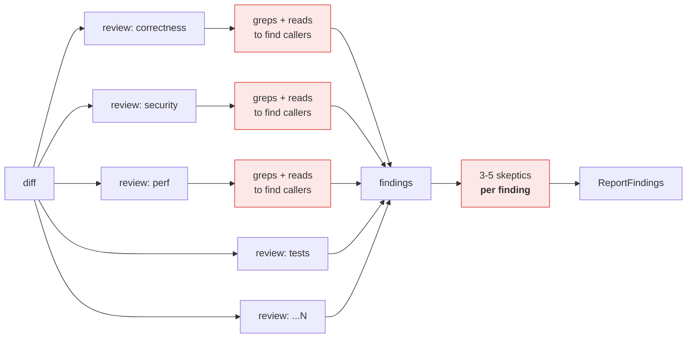
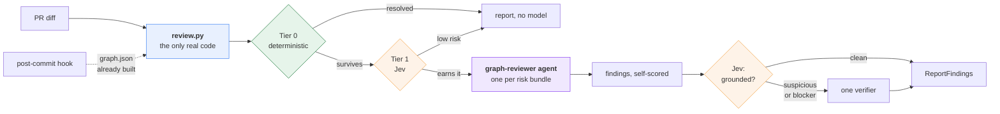
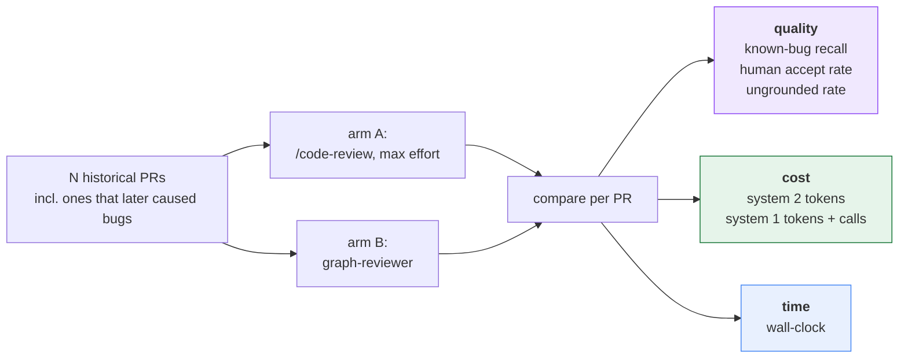
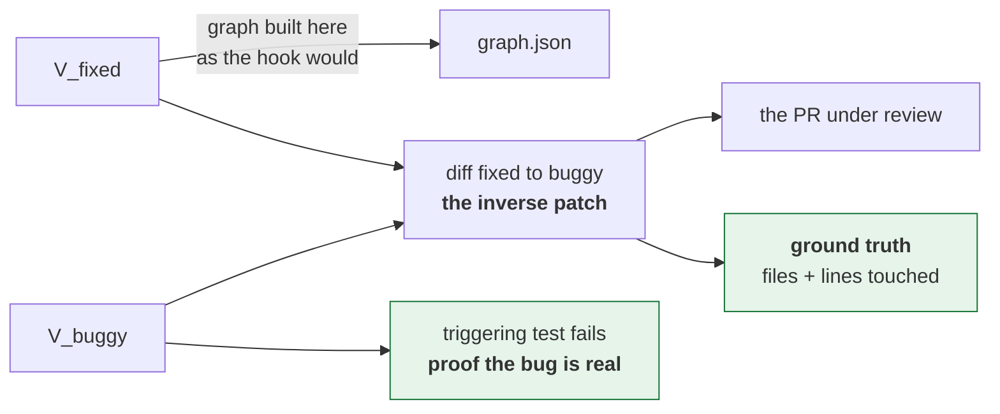
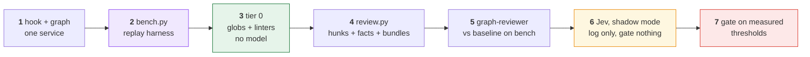

# Graph-Grounded Review Agent — Architecture

**Goal: beat Claude Code's `/code-review` at max effort on all three axes at once.**

| Axis | Target |
|---|---|
| **Quality** | Equal or better real-bug recall, fewer ungrounded comments |
| **Cost** | Fewer tokens in **system 1** (fast classifier) *and* **system 2** (reasoning LLM), both billed |
| **Time** | Lower wall-clock per PR |

Shaped as **one agent plus one script**, not an orchestration service.

> **Naming.** The *JEV-LLM-Graphify* pattern: **TypeSafe Jev** as system 1, **Claude** as
> system 2, **Graphify** for structure. System 1 is a **swappable slot** behind one HTTP
> contract — **Laya** ([`convaiinnovations/laya`](https://huggingface.co/convaiinnovations/laya))
> can replace Jev later by changing a base URL. See §4.1.

> **Supersedes** the previous revision's §9.5, which argued a flat-rate subscription
> weakened the case for cheap triage. Token cost is now an explicit goal, so triage is a
> first-class lever again — and §4 adds a **free tier beneath it**.

---

## 1. What we are beating

`/code-review` at max effort runs the canonical workflow shape: fan out **N dimension
reviewers** across the diff, then **adversarially verify each finding** with 3–5
independent skeptics, then report.



It is a strong baseline. Its costs are structural, and that is what makes them beatable:

**Cost ≈ `D × (S_diff + S_explore)` + `F × V × S_finding`**

| Term | What it is | Why it is waste |
|---|---|---|
| `D × S_explore` | Every dimension agent independently greps and reads to discover callers, callees and tests. | **The dominant hidden cost.** The same structural facts are rediscovered `D` times, by LLM, at full token price — and each grep is a serial round-trip, so it costs wall-clock too. |
| `D × S_diff` | Every dimension sees the whole diff, including the trivial parts. | A formatting hunk is paid for `D` times. |
| `F × V` | Every finding gets 3–5 skeptics. | An obviously-grounded finding is re-litigated as hard as a dubious one. |
| model tier | Max effort runs the top model everywhere. | A rename in a test file does not need the top model. |

Three of those four are addressable without touching recall. The fourth (`D`) is
addressable only if something else supplies the recall — which is §7's argument.

---

## 2. The three levers

```mermaid
flowchart TD
    subgraph L1["Lever 1 — precompute the facts"]
        A["AST graph built by post-commit hook<br/><b>local parse, zero tokens, off critical path</b>"]
        A --> B["Serve callers, callees, community, tests<br/>as facts in the prompt"]
        B --> C["<b>S_explore collapses to ~0</b><br/>no grep round-trips"]
    end

    subgraph L2["Lever 2 — spend in proportion to risk"]
        D["Free deterministic tier"] --> E["System 1 triage"] --> F["System 2 only where earned"]
        F --> G["<b>D and S_diff shrink to the hunks that matter</b>"]
    end

    subgraph L3["Lever 3 — budget the verification"]
        H["Verify suspicious findings, not all findings"]
        H --> I["<b>F x V shrinks to F_suspicious</b>"]
    end

    style C fill:#e6f4ea,stroke:#137333
    style G fill:#e6f4ea,stroke:#137333
    style I fill:#e6f4ea,stroke:#137333
```



Levers 2 and 3 cut cost and time with no quality claim attached — they do strictly less
redundant work. Lever 1 is the one that must also *carry* quality, because it is what
justifies reducing `D`. See §7.

---

## 3. Architecture



Everything left of `graph-reviewer` costs **zero system-2 tokens**. The graph is built by
a git hook before the PR exists, so it is off the critical path entirely.

---

## 4. The escalation ladder

Stop at the first rung that resolves the hunk. This is what keeps **both** systems cheap.

| Tier | Mechanism | Token cost | Handles |
|---|---|---|---|
| **0** | Path globs, linters, SAST, diff heuristics (pure-rename, pure-format, lockfile, generated code) | **zero** | Formatting, dependency CVEs, known patterns, and the hard overrides in §8 |
| **1** | Jev over a **compact structural record** — never the hunk (§4.1) | ~$0.042/1M, ~250 ms | Ranking, risk class, "does this need system 2 at all" |
| **2** | `graph-reviewer` agent, model tier chosen by risk | **system 2** | Actual reasoning about actual problems |

Tier 0 is not a formality. On a typical PR a large share of hunks are generated files,
lockfiles, imports and formatting. Every one resolved for free never reaches either model.

**Model tiering inside tier 2** is a pure cost lever the baseline does not use:

| Risk | Model | Effort |
|---|---|---|
| medium | cheap tier | `low` |
| high | top tier | `high` |
| sensitive path (§8) | top tier | `max`, plus a human |

### 4.1 System 1 is a swappable slot

**Today: Jev. Later: Laya. One base URL.**

`laya-serve` implements the same `POST /v1/systemone` request/response shape as TypeSafe
Jev. So tier 1 is defined by **that contract**, not by a vendor:

```bash
SYSTEM1_URL=https://api.typesafe.ai/v1/systemone   # today  - Jev
SYSTEM1_URL=http://localhost:8000/v1/systemone     # later  - laya-serve, self-hosted
```

Nothing else in the design moves. Keep the contract at the boundary and the vendor choice
stays reversible for the cost of an environment variable.

**Why Jev first.** It is usable zero-shot, and Laya is not:

| | Jev 1.13.0 | Laya base |
|---|---|---|
| typed-decisions accuracy | **0.727** | 0.362 *(below the 0.461 majority-class line)* |
| Usable without fine-tuning | **yes** | no — needs a labelled domain set first |
| Options supported | up to 255 | degrades past ~20 |

That removes an entire prerequisite from the critical path. With Laya, tier 1 could not be
switched on until enough labelled PR history existed to fine-tune against. With Jev, tier 1
works as soon as it is wired up — so shadow mode measures a *real* classifier from day one
instead of waiting on a training set.

**What it costs instead:**

| | Jev | Laya |
|---|---|---|
| p50 latency, 1 question | ~236–276 ms | ~33 ms |
| Price | $0.042 / 1M tokens | $0 self-hosted |
| Weights | closed API | Apache 2.0, on-prem |

The latency is the one that bites the **time** goal — roughly 7–8× Laya, on the critical
path, over the network. It is affordable only because tier 0 and bundling keep the *number*
of tier-1 calls small. Budget it explicitly in §10 rather than assuming it disappears.

> **These Jev figures are not verified.** Every one comes from **Laya's own model card** — a
> direct competitor — which states its Jev numbers are third-party published, never measured
> by them, with differing sample sizes and prompts. The card is also internally inconsistent
> on calibration (ECE 0.246 in its headline table, 0.144 in its typed-decisions table).
> Confirm against TypeSafe's own documentation before any of this gates a merge.

**Keep the compact structural record anyway.** It was originally forced by Laya's ~320-token
state budget. Jev's context limit is unknown to us, so it may not be *forced* — but it is
kept, for three reasons that stand on their own:

```python
state = {
  "change": "UpdateFolderAccessProcess.setup()  +12/-3",
  "entry_point": "none",           # annotation scan, tier 0
  "callers": "14 (EXTRACTED)",
  "communities_crossed": 2,
  "calls_into": "auth.TokenValidator",
  "tests_touching": 2,
  "linters": "clean",
}
```

1. **Confidentiality — the strongest reason.** Jev is a closed external API. This record
   sends *structure*, not source: no diff, no function bodies, no business logic. On a
   proprietary codebase that is the difference between a tolerable dependency and an
   unacceptable one. **Your code never leaves your infrastructure; only its shape does.**
2. **Swappability.** Laya needs ~320 tokens. Design to the tighter constraint now, or
   redesign at swap time.
3. **Latency and price both scale with input size**, and §10 measures both.

It is also the better factoring regardless of vendor: the classifier ranks *structure*, the
LLM reads *code*.

**Deferred until the Laya swap** — do not build these now, but do not lose them:

| Laya constraint | Action at swap time |
|---|---|
| `noul` follows its option labels (#156) | Rewrite every boolean as a two-option `choice` with neutral A/B keys |
| Ordinal `score` is weakest (SST-5 0.372) | Express risk as `choice`, not `score` |
| `act_probability` is anti-correlated (AUROC 0.30) | Gate on confidence (AUROC 0.77) |
| Base is below majority-class zero-shot | Fine-tune on PR history, then fit temperatures (ECE 0.466 → 0.081) |
| Auto-routes long English to a 512-token checkpoint | Pin the checkpoint explicitly |

Whether these apply to Jev is unknown — they are Laya-specific findings. Do not
pre-emptively code around another vendor's bugs.

---

## 5. The agent

`.claude/agents/graph-reviewer.md` — the whole agent is a prompt with a fact block.

```markdown
---
name: graph-reviewer
description: Reviews one risk-ranked hunk bundle with its graph neighborhood
             served as facts. Does not explore the repo.
tools: Read, Bash
---

You review ONE bundle of related changed hunks.

Structural facts below are DETERMINISTIC and already resolved. Do not grep
or search for callers, callees or tests — they are given. Read a file only
when a fact block points you at one and you need the body to decide.

## Facts (found edges only)
{callers, callees, community, covering tests, entry-point annotations}

## Hints (unverified, from system 1)
{e.g. "possible authz issue, p=0.81"} — confirm or refute each explicitly.

## Review for
correctness · security · concurrency · data access · breaking change ·
test coverage

## Output
For each finding: file, line, one-sentence defect, concrete failure
scenario (inputs/state -> wrong output), and severity.
Then score your own finding: grounded_in_diff, actionable, severity.
Drop anything you cannot ground in the diff or the facts.
```

Three things carry the design here:

1. **"Do not grep"** is the instruction that kills `S_explore`. It only works because the facts are genuinely there — otherwise the agent is blinded, not focused.
2. **Hints arrive as claims to verify**, never conclusions, so system 1 cannot quietly anchor system 2.
3. **Self-scoring in the same call** deletes a whole downstream stage. The agent holds the diff and the neighborhood; a separate scorer would see only the comment.

---

## 6. The one script

`review.py` — the only real program. Everything else is prompt, config or an existing tool.

```
diff --> hunks --> map to graph nodes (§9.1)
                      |
                      +-- tier 0 filters          -> resolved, drop
                      +-- attach facts            -> callers/callees/community/tests
                      +-- bundle by community     -> related hunks reviewed together, once
                      +-- rank by risk            -> system 1
                      |
                      v
              JSON: ordered bundles + facts + hints
```

**Bundling matters more than it looks.** Five hunks in one community touching the same
function are *one* review with one shared fact block, not five reviews that each re-derive
the same context. This is a second, independent cut at the `D × S_diff` term.

Output is plain JSON on stdout. The agent layer consumes it. No service, no queue, no DB.

---

## 7. The quality thesis

Cost and time wins are structural. **Quality is the claim that has to be argued and then
measured**, because lever 1 reduces `D`, and `D` is the baseline's recall mechanism.

> **Claim: recall comes from context, not from lens count.**

The baseline's reviewers are context-starved. They see the diff and must *choose* to go
looking for consequences, then pay per grep to do it — so in practice they often do not,
and the dominant miss category in real review is exactly that: **cross-file consequences
of a local-looking change**. Adding a seventh adjective to the lens list does not fix it.

A reviewer told *"this function has 14 callers, 3 in the auth community, covered by these
2 tests, and it is a `@ObservesAsync` entry point"* is working from the information that
actually finds those bugs.

So the trade is: **fewer agents, each much better informed.** Where lens diversity still
earns its keep — high-risk bundles, where disagreement is itself the signal — §3 escalates
to a second independent reviewer.

**This is a hypothesis with a clear failure mode**: if bundle-level review with facts has
worse recall than dimension fan-out, the benchmark in §10 will show it, and the fix is to
restore lens fan-out *on high-risk bundles only* — keeping the cost win everywhere else.

---

## 8. Guardrails

- **Hard overrides.** Auth, migrations, RLS and payment paths get the top model *and* a
  human, whatever any score says. Path globs, no model, tier 0. Cheapest and highest-value
  rule in the system — build it first.
- **Found edges only.** `EXTRACTED` edges are facts; `INFERRED` edges are soft hints to
  system 2 and never inputs to system 1.
- **No zero-means-safe.** Any absent graph signal is `unknown`, never a low-risk value.
  §9.2 is the reason this rule exists.
- **Graph freshness.** Verify the graph matches the PR head SHA before the run. A stale
  graph degrades every signal downstream with no error.
- **Deterministic stays deterministic.** Formatting, CVEs and known patterns never reach a
  model.
- **Feedback loop.** Log human accept/dismiss per comment and whether merged PRs later
  caused bugs. This is the only thing that calibrates system 1 to this codebase — and the
  only honest source of the quality number in §10.

---

## 9. Measured constraints

Measured on a real Quarkus service (`acme-orders`, graphify 0.9.27, 8031 nodes / 30573 edges).
**Constraints, not caveats** — §6 has to honour all of them.

### 9.1 Hunk → node mapping is lossy by construction

- `source_file` points into a **build-time staging copy**, not the working tree → needs a prefix rewrite.
- `source_location` is a **single start line** (`L30`), never a range, and is **absent on 36%** of nodes → the match is approximate; fall back to the file node and mark low precision.
- `metadata` is populated on **2 of 8031** nodes → no language or kind field; methods are identified by a leading `.` in the label.

### 9.2 `fan_in` is inverted on CDI-wired services

```
java method nodes:         3907
  fan-in 0:                2586   = 66.2%
REST / controller methods:   86
  fan-in 0:                  57   = 66.3%
```

```java
// EventLogController.java:43 — fan-in 0 in the graph,
// invoked on every audit event in production
public void onAuditEvent(@ObservesAsync AuditEvent event) {
```

`@Inject` in **117** files, `@Path` 28, `@Produces` 24, `@Observes` 18. `fan_in: 0`
disproportionately means **framework entry point** — the high-risk case. Emit `unknown`,
and derive entry-point status from **annotations scanned in source**, not from topology.
The annotation scan is tier 0: free, and it is what makes the fact block trustworthy
enough for §5's "do not grep" instruction to be safe.

### 9.3 `path_to_sensitive` is noise as specified

`graphify path` walks all relation types, undirected, through test files:

```
EventLogController <--contains-- EventLogController.java --imports--> Constants
  <--imports-- QueryBuilderTest.java --imports--> JsonObject
```

Restrict to **directed `calls` edges**, exclude tests, cap length — or drop the feature.

### 9.4 What works

`EXTRACTED` 24457 / `INFERRED` 6116 (80/20) — the found-vs-inferred guardrail is
implementable exactly as written. Relations: `calls` 9224, `references` 8819,
`imports` 7743, `method` 3907, `contains` 643, `inherits` 119, `implements` 65.

### 9.5 Capabilities that do not exist

`graphify prs --triage` is not a command in 0.9.27; queue-level PR ranking must be built or
dropped. There is no MCP server mode — `graphify install` copies a *skill*.

---

## 10. Proving it — the benchmark harness

**"Outperforms" is not a design property. It is a measurement**, and without this section
the rest of the document is a hypothesis.



| Metric | Definition | Honest expectation |
|---|---|---|
| **Known-bug recall** | Of PRs that later caused a bug, how many did the arm flag at the right place? | The number that decides it. Must be **≥** baseline. |
| **Human accept rate** | Comments accepted vs dismissed | Should rise — grounded facts reduce speculation |
| **Ungrounded rate** | Comments not supported by diff or facts | Should fall |
| **System 2 tokens** | Billed reasoning tokens | Structural win — strictly less redundant work |
| **System 1 cost** | Jev tokens + call count + added p50 latency | Cheap per call (~$0.042/1M) but **~250 ms each on the critical path** — tier 0 and bundling must keep the call count low, or this eats the time win |
| **Wall-clock** | PR open → review posted | Structural win — no grep round-trips, no barriers, graph prebuilt |

**`bench.py` is not optional and not last.** Build it at step 2 of §11 and run every stage
against it, or the cost wins get spent on quality losses nobody measured.

### 10.1 Which public benchmark

**SWE-bench is the wrong shape.** It measures *patch generation* — given an issue,
produce a patch that passes hidden tests. This agent never generates a patch; it reads a
diff and finds defects. Scoring it on SWE-bench measures a capability we do not ship.

**The filter that eliminates most of the field: repo-level, not snippet-level.** Lever 1
is the whole design — callers, callees, communities and tests served as facts. A
function-level dataset has no repository to index, so Graphify has nothing to build a
graph from and **lever 1 becomes untestable by construction**. That rules out Devign,
BigVul, DiverseVul and PrimeVul. They are fine for a vulnerability classifier; they cannot
evaluate a graph-grounded reviewer.

**Primary: Defects4J, inverted.** Java — matching `acme-orders` and every measurement in §9 —
repo-level, and each bug ships a triggering test, so ground truth is *executable* rather
than annotated opinion.



Defects4J holds `V_buggy` and `V_fixed` differing **only in source** — the test suite is
held constant — so diffing fixed→buggy yields a clean bug-introducing change with no test
noise mixed in.

**One benchmark per tier.** They measure different claims and no single corpus covers all:

| Stage | Benchmark | Question it answers |
|---|---|---|
| Step 5 decision point | **Defects4J**, inverted | Does graph-grounded bundle review out-recall dimension fan-out? |
| Tier 1 shadow mode | **ApacheJIT** (SZZ-labelled Apache Java commits) | Can structural features rank risk at all? |
| Tier 0 | **OWASP Benchmark** (Java, seeded CWEs) | What do linters and SAST already cover for free? |
| Cost + time, decisive | **Own PR history** | Everything else in §10 |

**Defects4J validates the quality hypothesis but not the cost hypothesis.** Its bugs are
*minimised* — usually a single hunk. A one-hunk PR never exercises tier 0 filtering, never
exercises community bundling, and gives triage nothing to rank. So it settles §7 and says
**nothing** about levers 2 and 3, which is where the token and time wins live. Cost and
time need realistic, noisy PRs: generated files, lockfiles, formatting, twelve hunks across
four communities. That is own history. **This is why §10 stays primary and §10.1 is
supplementary.**

Two further caveats:

- **Contamination.** Defects4J and SWE-bench are old and near-certainly in training data; a
  model may *recall* a famous bug rather than find it. Control with a recent-only set —
  GitBug-Java exists for this reason — or with own recent PRs.
- **A reversed fix is not a real bug-introducing commit.** Removing a null check reads as
  obviously wrong in a way real bugs rarely do, which inflates recall. ApacheJIT's
  SZZ-derived commits are *real* bug-inducing changes and do not have this artefact — a
  second reason to run both.

> **Dataset sizes are unverified.** Web lookup was unavailable when this section was
> written, so all counts (Defects4J ~835 bugs / 17 projects, SWE-bench Verified 500,
> ApacheJIT ~106k commits, OWASP ~2 740 cases, GitBug-Java ~199) are from memory. Confirm
> at source before citing.

**Running it:**

```bash
python bench.py prepare --bugs Lang:1,Math:5 --out tasks/     # needs defects4j on PATH
# ... run each arm, emit <bug>.json per task ...
python bench.py score --tasks-dir tasks/ --findings-dir out/graph/
python bench.py score --tasks-dir tasks/ --findings-dir out/baseline/
python bench.py selftest                                      # no defects4j needed
```

`bench.py` does **not** invoke the arms. It prepares tasks and grades answers, so it stays
neutral between them and runnable on its own. Metrics it reports per arm:
`localization_rate`, `mean_findings_per_bug` (noise), `precision_proxy`, and
`mean_rank_of_first_hit` — rank matters because reviews are read top-down, so a hit buried
under nine false positives is worth less than one at the top. A missing findings file
counts as a **miss**, never a skip, so an arm that crashes on a bug cannot be flattered by
its own failure.

---

## 11. Build order and file manifest



**Choosing Jev deletes a step.** The Laya variant needed a fine-tune-and-calibrate stage
between shadow mode and gating, because its base checkpoint scores below the majority-class
baseline (§4.1). Jev is usable zero-shot, so step 6 measures a real classifier immediately.

Thresholds still have to be set from replayed history at step 7 — that is threshold
calibration, not model training, and it is required whichever vendor fills the slot.

Step 5 is the real decision point: **graph-grounded bundle review against the baseline,
before any of the triage machinery exists.** If lever 1 does not hold quality on its own,
levers 2 and 3 are just a cheaper way to be worse, and you want to know that at step 5
rather than step 7.

| File | Lines | Purpose |
|---|---|---|
| `review.py` | 411 | diff → hunks → facts → bundles → ranked JSON. **The only real program.** |
| `bench.py` | 251 | Defects4J task prep + localization scoring (§10.1) |
| `system1.py` | 227 | `POST /v1/systemone` client. The swap seam (§4.1). |
| `diffparse.py` | 160 | Unified-diff parsing, shared by review + bench |
| `.claude/agents/graph-reviewer.md` | 82 | The agent. Prompt, not program. |
| `.claude/skills/graph-review/SKILL.md` | 75 | Entry point: run `review.py`, dispatch agents |
| `setup-defects4j.sh` | 65 | One-time benchmark toolchain install |
| `overrides.toml` | 36 | Tier-0 sensitive / skip / test globs |

Larger than the original estimate, and the excess is almost entirely
`selftest()` — every module carries a runnable self-check, and `system1.py`'s
asserts that **no source code can reach the external API**.

### Built, with two deviations from this document

1. **Bundling is by package directory, not Graphify community.** The real graph
   ships no community data — `hyperedges` is empty and clustering was never run.
   For Java the package *is* the module boundary, so this is free, deterministic
   and drops a dependency on an optional Graphify feature.
2. **The agent gets `tools: Read` and no search tool.** §5 stated "do not grep"
   as an instruction; withholding the tool enforces it structurally. Stronger and
   smaller.

### What the first real run showed

`acme-orders` commit `a1b2c3d4e`, against the live 23 MB graph, **0.5 s**:

```
26 hunks -> 13 resolved free at tier 0 (50%) -> 4 bundles
b001  153  sensitive  Migration{EventOrchestrator,MessageReceiver}.java
b002  124  sensitive  ImportMessageReceiver.java
b000   16             LayeredCache.java
b003    7             LockExecution.java, Mutex.java   (new package, not in graph)
```

The top bundle's basis reads `sensitive path (+100); entry point @ObservesAsync
(+25); 4 symbol(s) with unknown fan-in (+10)`. That is **§9.2 happening live**: a
CDI async observer the graph cannot see callers for. A naive `fan_in: 0` would
have ranked it as dead code; the source annotation scan makes it the top item.

Three defects surfaced only because the run used a real repo and a real graph:

- **`covering_tests` was structurally always empty.** Test→source edges land on
  the *class* node (`FooIT -references-> Foo`), never the method node, so a
  per-symbol lookup found nothing and reported "no tests" for well-covered
  classes — while adding a constant +10 to every bundle. Now resolved at file level.
- **A 226-line `DESIGN.md` outranked all real code**, having inherited the
  sensitive flag from its directory. Docs now resolve at tier 0; that is most of
  the 50% drop rate.
- **`is_whitespace_only` caught only reindentation.** Fixed, with a
  string-literal guard — collapsing whitespace inside `"a  b"` would silently
  drop a real change.

Tier-1 degradation is verified: with the endpoint unreachable the run exits 0,
reports `system1_ok: 0/4`, and routes every bundle to `full` or `human+top`.
**Nothing downgrades to `light` on failure.**

Reused instead of written: the graph (graphify + its git hook), linters and SAST already in
CI, the agent runtime, `ReportFindings`.

---

## 12. Open questions

- **Does lever 1 hold quality alone?** §7 is a hypothesis. Step 5 settles it — and it is the
  one that decides whether any of this beats the baseline.
- **Is structural-features-only enough signal to rank risk?** §4.1 keeps the hunk out of the
  state. Defensible in principle (the classifier ranks structure, the LLM reads code) but
  untested. If ranking is weak, the next move is a *tier-0 summary line* of the hunk — not
  the raw hunk, which would forfeit the confidentiality property.
- **Jev's real numbers.** Every Jev figure in §4.1 comes from a competitor's model card,
  self-declared as third-party and unmeasured, and internally inconsistent on ECE
  (0.246 vs 0.144). Confirm accuracy, calibration, **context limit** and rate limits against
  TypeSafe's own documentation before step 6.
- **Is an external API acceptable for this codebase?** Jev is closed and off-premise. The
  feature record means source never leaves — but file and symbol names still do. If that is
  ruled out, the slot (§4.1) is exactly what lets self-hosted Laya take over, at the price
  of the fine-tune prerequisite.
- **Does ~250 ms × N calls fit the time budget?** The wall-clock goal assumes tier 0 and
  bundling keep tier-1 call volume low. Measure it at step 6; if it dominates, batch the
  calls or move ranking to tier 0 heuristics.
- **Bundling granularity.** Community-level may be too coarse on large communities. Needs a
  size cap, tuned on the bench.
- **Target service.** §9 measures `acme-orders`. A non-CDI codebase changes §9.2 substantially.
