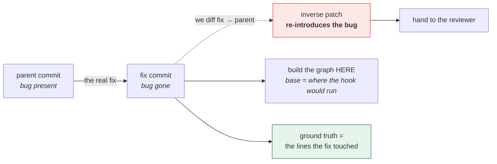
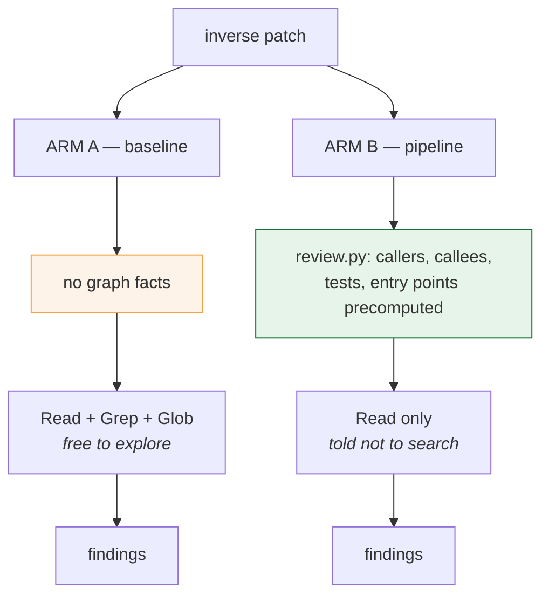
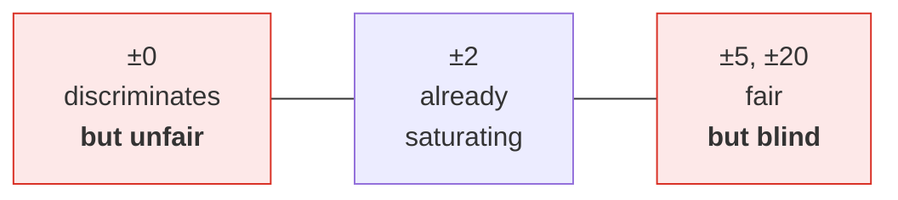

# The 5-fix benchmark — what it did, and why it failed

A walkthrough of the A/B run, written for someone who has not seen the harness.

**Short version:** it ran cleanly and produced a tie, but the tie is an artefact
of the scoring, not a real result. The run is evidence for neither arm. This
document explains the construction, the numbers, and exactly where it breaks —
because knowing *why* a benchmark is invalid is what tells you how to fix it.

---

## 1. The question

> Does serving graph facts to the reviewer make it find real bugs better than
> the same model that has to go looking for them itself?

That is §7's hypothesis — *recall comes from context, not from lens count*. It is
the one claim in `architecture.md` that cost savings do not settle, so it needs a
measurement.

---

## 2. The construction: run history backwards

We need diffs with a **known** bug in a **known** place. Real PRs do not come
labelled. But a *bug-fix commit* does: whatever it changed is where the bug was.

So we run it backwards.



So the reviewer sees a patch that **adds a bug**, and we already know which lines
it lives on. `bench.py prepare_git()` builds this; `--shas` takes the fix commits.

Two details that matter:

- **The graph is built at the fix commit, not the parent.** That is the "base" a
  PR would be opened against, so it is where the post-commit hook would have run.
- **Ground truth is the fix's own lines**, in the coordinates of the file the
  reviewer sees.

---

## 3. The five bugs

Real fix commits from a production Java service. Identifiers are genericised here;
the sizes and counts are the real ones.

| # | What the fix repaired | diff lines shown | ground-truth lines | files |
|---|---|---|---|---|
| 1 | Removing one array element wiped the whole field when another remove preceded it | 13 | 2 | 2 |
| 2 | Several index-based array removes overwrote each other in one patch | 28 | 6 | 3 |
| 3 | Thread-unsafe mutation of a shared JSON mapper in a publisher | 26 | 4 | 2 |
| 4 | Null-pointer risk when a JSON cast threw *before* the catch block | 24 | 7 | 2 |
| 5 | Per-request database read on a hot path that should have been batched | 112 | 24 | 6 |

These are ordinary production bugs — concurrency, null handling, data loss,
performance — not synthetic mutations. **"diff lines shown" is the number the
whole experiment turns on.** Hold on to it.

---

## 4. The two arms

Both arms are **the same model** (`opus`) running **the same review instructions**.
Exactly one thing differs.

> The run predates the tier-1 verdict stage (0.2.0). Both arms' findings were scored
> on where they landed, so the verdict, which only assigns `block/fix/note`, does not
> change these numbers. Re-running on 0.2.0 would also surface `scope` and `verdict`.



Arm A is **not** a weak strawman. It gets search tools the pipeline arm is denied,
so it can discover anything the graph would have told it — it just has to spend
tokens and round-trips doing so. That is the honest comparison: the graph does not
add information that is otherwise unavailable, it makes it **free**.

---

## 5. How scoring works

`bench.py score_one()` asks: **did any finding land on a ground-truth line, within
a tolerance of ±N?**

A worked example from bug #1:

```
ground truth for Foo.java: lines 42, 43        (what the fix changed)

  reviewer says "line 42"  → hit at ±0, ±2, ±5
  reviewer says "line 45"  → miss at ±0 · miss at ±2 · HIT at ±5
  reviewer says "line 80"  → miss at every tolerance
```

Three numbers come out:

| Metric | Meaning |
|---|---|
| `localization_rate` | fraction of bugs where **at least one** finding hit |
| `precision_proxy` | of all findings, what fraction hit |
| `mean_rank_of_first_hit` | position of the first hit — reviews are read top-down, so a hit buried under nine false positives is worth less |

A **missing findings file counts as a miss**, never a skip, so an arm that crashes
cannot be flattered by its own failure.

---

## 6. What happened

### Per bug, at the default ±5

| bug | arm B hits/found | arm A hits/found |
|---|---|---|
| 1 | 5 / 5 | 3 / 3 |
| 2 | 6 / 7 | 4 / 4 |
| 3 | 6 / 6 | 4 / 4 |
| 4 | 8 / 8 | 5 / 5 |
| 5 | 20 / 21 | 6 / 6 |

Both arms localized **all five**. Nearly every finding counted as a hit.

### Sweeping the tolerance

| tolerance | arm B (pipeline) | arm A (baseline) |
|---|---|---|
| ±0 | loc 0.80 · prec 0.64 | **loc 1.00 · prec 0.82** |
| ±2 | 1.00 · 0.92 | 1.00 · 0.95 |
| ±5 *(default)* | 1.00 · 0.96 | 1.00 · 1.00 |
| ±20 | 1.00 · 1.00 | 1.00 · 1.00 |

---

## 7. Why this is not a result

**The tolerance window is nearly as large as the thing being searched.**

Do the arithmetic on bug #1: ground truth is 2 lines. At ±5 each covers 11 lines,
so the two together blanket **22 lines** — and the reviewer was only shown **13**.

```
diff shown:      |-------------|              13 lines
±5 around truth: |--------------------------| 22 lines
```

Every possible answer is inside the target. The reviewer cannot miss, so the
metric measures *"did it say anything"* rather than *"did it find the bug"*.

It is worth being precise about the cause: **the ground-truth ratio was fine** —
truth was only 15–29% of each diff. The saturation comes entirely from the
tolerance window, not from over-broad truth.

### Tightening does not rescue it

At ±0 the metric does separate the arms — and the **baseline wins** (1.00/0.82
against 0.80/0.64). But ±0 is not a fair bar. A reviewer who flags the line above
a null-check is *correct*; penalising that measures line-precision, not
bug-finding.



**No tolerance is both fair and discriminating at this diff size.** The arms
converge as you loosen it and invert as you tighten it — which is the signature of
a metric with no valid operating point.

> **Reusable check:** before trusting any localisation benchmark, sweep the
> tolerance. If loosening merges the arms and tightening flips them, the numbers
> mean nothing.

---

## 8. The one real signal

| | findings per bug |
|---|---|
| arm B (graph facts) | **9.4** |
| arm A (baseline) | 4.4 |

The pipeline arm reported **2.1× as many findings**. On bug #5 — the large one, 112
lines across 6 files — it was 21 against 6.

That is a large behavioural difference, and it is consistent with the facts giving
the reviewer more it can justify saying. But **whether those extra findings are
real bugs or noise is exactly what a localisation metric cannot tell you.** Both
arms found the seeded bug; the question is what else arm B said, and that needs a
human or a semantic judge.

Do not read 2.1× as a win. Read it as the thing worth measuring next.

---

## 9. How to fix the benchmark

The construction needs the bug to be **small relative to what the reviewer sees** —
the opposite of what was built. Three options:

| | Approach | Cost |
|---|---|---|
| 1 | **Bury the bug-introducing hunk in a realistic multi-file PR** alongside unrelated changes, so picking it out is a real choice | low — reuses this harness |
| 2 | **Defects4J** — its bugs are minimised inside large files, exactly the ratio missing here, and each ships a triggering test as proof | multi-GB install |
| 3 | **Judge semantically** — does the finding *describe* the defect, rather than land near it | needs a grader model |

Option 1 is the cheapest path to a number that means something.

---

## 10. Reproducing it

```bash
# 1. build tasks from your own fix commits
python bench.py prepare-git --repo /path/to/repo \
    --shas <sha1>,<sha2>,<sha3> --out tasks/

# 2. for each task: check out the fix commit, build the graph there
git -C /path/to/repo checkout --detach <sha>
graphify update /path/to/repo --no-cluster --force

# 3. arm B
python review.py --diff task.diff --graph graphify-out/graph.json --repo . > b.json
python agent.py --bundles b.json --repo . > out/graph/<task>.json

# 4. arm A: same prompt minus the facts, plus search tools
claude -p "<the diff>" --agent baseline-reviewer --model opus \
       --output-format json --permission-mode dontAsk

# 5. score, and ALWAYS sweep the tolerance
for t in 0 2 5 20; do
  python bench.py score --tasks-dir tasks/ --findings-dir out/graph/ --tolerance $t
done
```

Finding the fix commits in the first place:

```bash
git log --oneline -400 --format="%h %s" -- '*.java' | grep -iE "^[0-9a-f]+ fix"
```

### Two things that cost real time here

**`graphify update --no-cluster` emits `links`, not `edges`.** Clustered graphs use
`edges`. Every task crashed with `KeyError: 'edges'` until `review.py` accepted
both. Note the near-miss: `raw.get("edges", [])` would have looked like a fix and
silently produced a graph with every node and **zero** relationships.

**Rebuild the graph per commit.** Reviewing a 2026 commit against a graph built
months earlier means stale line numbers, and `nodes_for()` quietly degrades from
`precision: "line"` to `precision: "file"`. It takes ~30 s per commit in a
throwaway `git worktree`, which keeps your working tree untouched.
