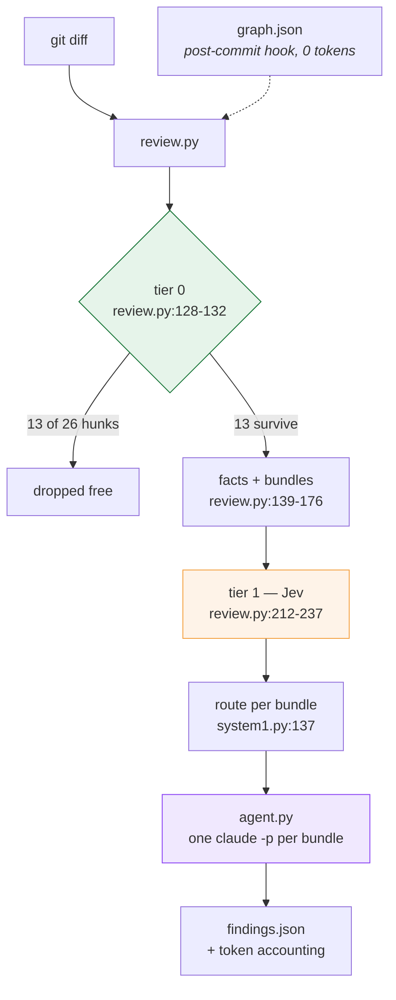
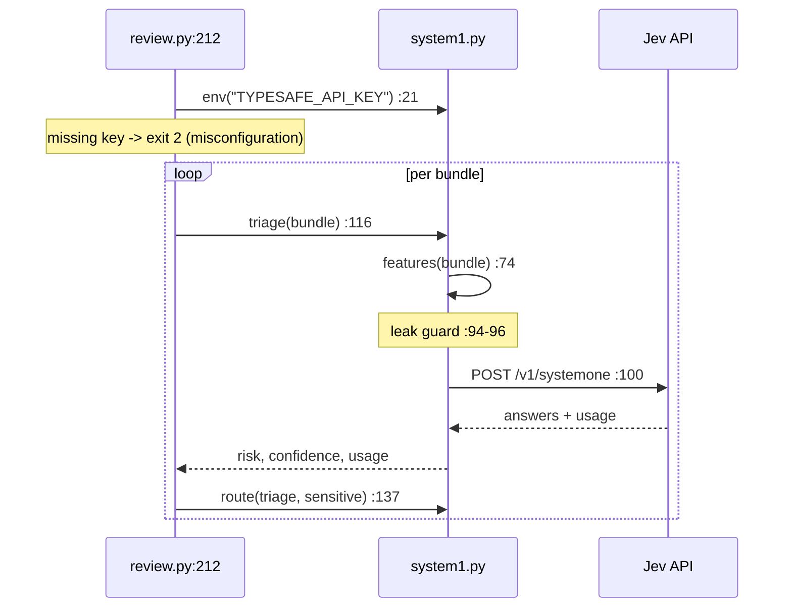
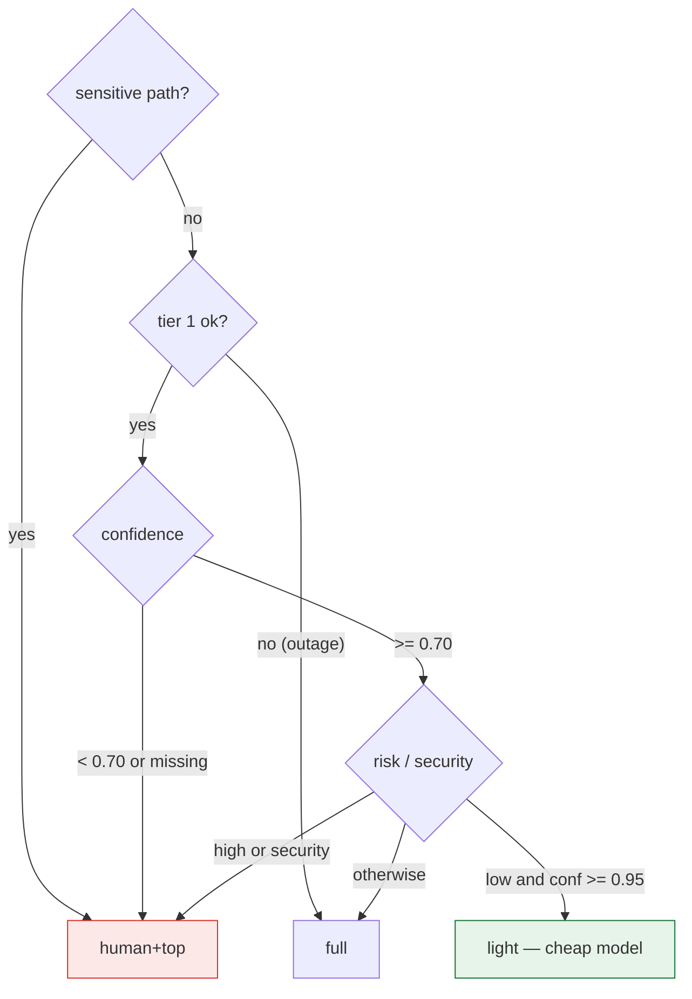
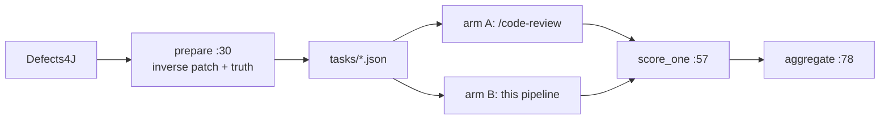

# Call Flow — how one review actually runs

Implementation walkthrough. Every reference is `file:line` against the code as
it stands. For *why* it is built this way, see `architecture.md`; this document
is *what calls what*.

Numbers throughout are from a real run: `acme-orders` commit `a1b2c3d4e`, against a
23 MB graph (8031 nodes / 30573 edges).

---

## The whole run in one picture



Three processes, three cost tiers. `review.py` and `system1.py` finish in
**2.1 s**; `agent.py` takes **3m06s**. That ratio is the design.

---

## Stage 1 — `review.py`: diff to bundles

`python review.py --diff pr.diff --graph graph.json --repo .`

### 1a. Parse the diff — `diffparse.py`

`parse_hunks()` (`diffparse.py:56`) walks the unified diff and emits `Hunk`
objects (`diffparse.py:17`). Three properties carry the load:

| Property | Line | Note |
|---|---|---|
| `touched` | `diffparse.py:24` | New-file line numbers. A **deletion consumes no new line**, so it anchors where it was — a removed guard is flagged there. |
| `end` | `diffparse.py:38` | Last new-file line, counting only non-`-` lines. |
| `is_whitespace_only` | `diffparse.py:42` | Collapses whitespace runs **only outside string literals** — inside one, whitespace is content, and a false positive here is a real change never reviewed. |

`norm()` (`diffparse.py:11`) strips `a/`/`b/` and normalises slashes. It is the
one path function shared by `review.py` and `bench.py`.

### 1b. Tier 0 — free, deterministic

`review.py:128-132`:

```python
for h in parse_hunks(diff):
    why = ("skip-glob" if hit(h.path, ov["skip"]) else
           "whitespace-only" if h.is_whitespace_only else None)
    (dropped if why else keep).append(...)
```

`hit()` (`review.py:35`) is `fnmatch` against `overrides.toml`, loaded by
`load_overrides()` (`review.py:30`). **No model runs here.** On the real diff
this resolved **13 of 26 hunks (50%)** — almost all a 226-line `DESIGN.md`.

### 1c. Index the graph — one pass, five indices

`Graph.__init__` (`review.py:45`) walks 30573 edges once and builds:

| Index | Line | Purpose |
|---|---|---|
| `by_id` | 46 | node lookup |
| `by_base` | 47-51 | basename → nodes, for the **suffix** path join |
| `fan_in` | 58-59 | incoming `calls`, **`EXTRACTED` only** (`review.py:56`) |
| `callees` | 60 | outgoing `calls` |
| `incoming` | 61-62 | `calls` + `references`, used for test coverage |

The `confidence != "EXTRACTED"` guard at `review.py:56` is §9.4: inferred edges
never become numbers.

### 1d. Map hunks to nodes

`Graph.nodes_for()` (`review.py:68`) → `(nodes, precision)`:

- `in_file()` (`review.py:64`) matches by **suffix**, because graph `source_file`
  points into a build-time staging copy that may no longer exist.
- If any node's line falls inside the hunk → `precision: "line"`.
- Otherwise → all nodes in the file, `precision: "file"`. 36% of nodes carry no
  line number, and graph drift demotes the rest.
- No match → `precision: "none"` → the bundle is flagged `in_graph: false`.

### 1e. Build the facts

Three sources, deliberately different:

| Fact | Source | Line |
|---|---|---|
| `callers` | graph `fan_in` | `review.py:158` |
| `entry_point_annotations` | **source scan, not the graph** | `entries()` `review.py:88` |
| `covering_tests` | graph, **file level** | `tests_for()` `review.py:75` |

Two of these encode measured findings:

**`review.py:158`** — `callers` is `UNKNOWN` when fan-in is zero, never `0`.
On this service 66% of methods have no callers in the graph because CDI wires
them; zero means *unmeasured*, and reporting `0` would teach a risk model that
entry points are safe.

**`tests_for()` is file-level on purpose** — test→source edges land on the
*class* node (`FooIT -references-> Foo`), never the method node, so a
per-symbol lookup silently returns "no tests" for a well-covered class.

### 1f. Bundle and rank

`review.py:134-176`. Group by **package directory** (`review.py:136`) — this
graph ships no community data, and for Java the package is the module boundary.
Sort by `(path, start)` before chunking (`review.py:140`) so a file's hunks stay
together, then chunk by `--max-bundle` (default 12 -- each bundle is one agent paying
its own cold cache write, so coarse beats fine).

`rank()` (`review.py:98`) produces a deterministic tier-0 prior **and its
basis**, so the ordering is explainable:

```
sensitive path (+100); entry @ObservesAsync (+25);
4 symbol(s) unknown fan-in (+10); max fan-in 2 (+2);
no covering tests (+10); 6 hunk(s) (+6)   = 153
```

---

## Stage 2 — `system1.py`: Jev triage

Runs inside `review.py:212-237`, on by default. `--no-system1` opts out.



### 2a. Key resolution — `env()` (`system1.py:21`)

Environment first, then `.env` beside the module. A shell `export` does not
survive into CI, a git hook, or another tool's shell, so the key needs a home on
disk that is not tracked content (`.env` is in `.gitignore`).

**Two failure modes, deliberately different** (`review.py:212-220`):

| Situation | Behaviour |
|---|---|
| No key — **misconfiguration** | Hard `exit 2` before any work. |
| Key present, endpoint down — **outage** | `ok: false` → `route()` escalates. Never downgrades. |

### 2b. The payload — `features()` (`system1.py:74`)

Nine scalar fields, ~70 tokens. **No diff, no source.** Names and counts travel;
code does not.

```python
{"change": "ImportEventOrchestrator.java, ... (6 hunks)",
 "package": "src/main/java/com/acme/orders/migration",
 "symbols": ".safeCache(), .receiveMessage(), ...",
 "entry_point": "@ObservesAsync",
 "max_callers": "2", "unknown_callers": 4,
 "covering_tests": 0, "sensitive_path": "yes", "found_in_graph": "yes"}
```

**`system1.py:94-96` is a runtime guard, not a test.** Every field above is a
single-line name or count, so a `@@` or an escaped newline in the serialised
record means diff text got in — and it raises:

```python
if "@@" in blob or "\\n" in blob:
    raise ValueError("source code leaked into the system-1 record")
```

This is what makes a closed external vendor acceptable against a proprietary
codebase.

### 2c. The request — `ask()` (`system1.py:100`)

```json
{"model": "jev-latest", "state": {...}, "questions": {...}}
```

`model` is **required** — the API returns `422 {"loc":["body","model"]}` without
it. `GET /v1/models` lists what a key may use: `jev-latest`, `jev-preview`.
Server reports back `jev-1.13.0`.

### 2d. The questions — `system1.py:42-71`

Only two, because `tests_missing` and `needs_deep_review` are already known
deterministically — never pay a model for what tier 0 computed.

**Instruction quality is load-bearing, and this is measured.** Routing gates on
*confidence*; a vague instruction returns a low-confidence answer, which
escalates every bundle and silently cancels the tiering lever:

| Instructions | Jev's confidence, same record |
|---|---|
| One-line ("How risky is this change?") | **0.33** → escalate |
| With explicit disambiguation (`system1.py:45-51`) | **0.97** → routes `light` |

The disambiguation that mattered: *"Treat max_callers 'unknown' as UNMEASURED,
never as zero."*

### 2e. Routing — `route()` (`system1.py:137`)

Evaluated top-down; **every absence of signal escalates**:



Real result on this diff — note **nothing reached `light`**:

| bundle | Jev risk | conf | security | route |
|---|---|---|---|---|
| b001 migration | high | 1.00 | input | `human+top` |
| b002 migration | high | 0.98 | input | `human+top` |
| b000 cache | low | **0.54** | none | `human+top` — below the 0.70 floor |
| b003 mutex | medium | 0.85 | none | `full` |

b000 is the design working: Jev said *low* but wasn't sure, so it escalated
rather than downgrading.

---

## Stage 3 — `agent.py`: Claude on the subscription

```bash
python agent.py --bundles bundles.json --repo .
```

### 3a. One subprocess per bundle — `review()` (`agent.py:45`)

```python
"claude", "-p", json.dumps({k: bundle[k] for k in KEYS}, indent=2),
"--agent", AGENT, "--model", model,
"--output-format", "json",
"--permission-mode", "dontAsk",
```

Four things matter here:

- **`claude -p` runs on the subscription**, not an API key. The only key in this
  system is `TYPESAFE_API_KEY`.
- **`--agent graph-reviewer`** loads `~/.claude/agents/graph-reviewer.md`, which
  carries the prompt *and* the `tools: Read` grant. The interactive skill uses
  the same definition, so both runtimes review identically — otherwise the
  benchmark would compare two different reviewers.
- **`KEYS`** (`agent.py:29`) sends only `id, package, sensitive, facts, hunks`.
- **`dontAsk`** — a permission prompt in a non-interactive run is a hang.

**This is one call, not an agent loop.** `review.py` already resolved the facts,
so there is nothing for the model to discover. That is the cost thesis.

### 3b. Error handling — `agent.py:60-64`

```python
body = json.loads(out.decode() or "{}") if out else {}
if proc.returncode != 0 or body.get("is_error"):
    msg = str(body.get("result") or err.decode(...)).strip()
```

Claude Code reports failures as `is_error` in the JSON **on stdout**; stderr is
usually empty. Reading stderr alone loses the message entirely — that is how the
inaccessible-model error first showed up as a silent blank.

### 3c. Parsing — `findings_from()` (`agent.py:32`)

`--output-format json` wraps the reply; the reply is the JSON array the agent
definition asks for. `re.search(r"\[.*\]", text, re.S)` tolerates a code fence or
surrounding prose.

### 3d. Concurrency — `run()` (`agent.py:80`)

`asyncio.Semaphore` (`:82`) caps in-flight subprocesses; `asyncio.gather` (`:92`)
fans out. `one()` (`:84`) swallows per-bundle exceptions and returns `[], {}` —
**one bundle must not sink the run**.

### 3e. Model tiering — `agent.py:27, 46`

```python
model = cheap if bundle.get("route") in CHEAP_ROUTES else "opus"
```

`CHEAP_ROUTES = {"light"}`. `--cheap-model` defaults to `opus` because this
account cannot reach `sonnet` — the lever is built but currently inert.

### 3f. Exit code — `agent.py:154`

```python
return 1 if blockers or sensitive else 0
```

Non-zero fails CI on either a blocker **or** an untriaged sensitive bundle.

---

## Token accounting — `accounting()` (`agent.py:96`)

Reads Jev's totals from `stats.system1_usage` (already summed at
`review.py:227`) rather than recomputing, and aggregates Claude's from each
subprocess result.

Measured on the real diff:

| | calls | input | output | cache read | cost |
|---|---|---|---|---|---|
| **system 1 — Jev** | 4 | 2,964 | 360 | — | **$0.00014** billed |
| **system 2 — Claude** | 4 | 32 | 35,633 | 253,890 | $1.92 *notional* |

Two things to read off this:

- **Jev costs 0.007% of Claude.** That is the triage economics as a measurement
  rather than an argument.
- **`notional_usd` is not a bill.** Claude Code reports an API-equivalent figure
  even on a subscription; it is only useful for comparing arms.

253,890 cache-read tokens against 32 input tokens means prompt caching on the
agent definition is carrying nearly the whole prompt.

---

## Where `bench.py` attaches

`bench.py` never invokes either arm — it prepares tasks and grades answers, so
it stays neutral and runs without Claude or Jev.



`prepare_bug()` (`bench.py:30`) diffs `V_fixed → V_buggy`, so the "PR" is a
change that *introduces* a known bug, with the triggering test as proof.
`score_one()` (`bench.py:57`) reports `rank_of_first_hit`, because reviews are
read top-down. A **missing findings file counts as a miss**, never a skip
(`bench.py:132-137`) — an arm that crashes must not be flattered by its own
failure.

---

## Full command sequence

```bash
# once: keep the graph current (local AST parse, no tokens)
graphify update . && graphify hook install

# per review
git diff origin/main...HEAD > pr.diff
python review.py --diff pr.diff --graph graphify-out/graph.json --repo . > bundles.json
python agent.py --bundles bundles.json --repo . > findings.json
echo $?        # 1 = blockers or sensitive bundles
```

Interactively, `/graph-review` runs the same three stages inside Claude Code.
