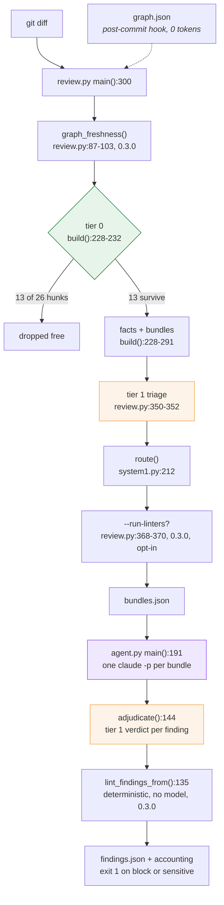
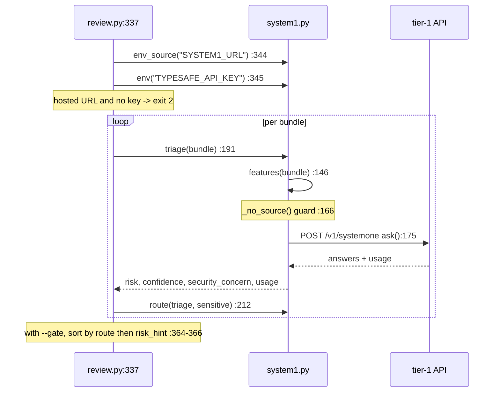
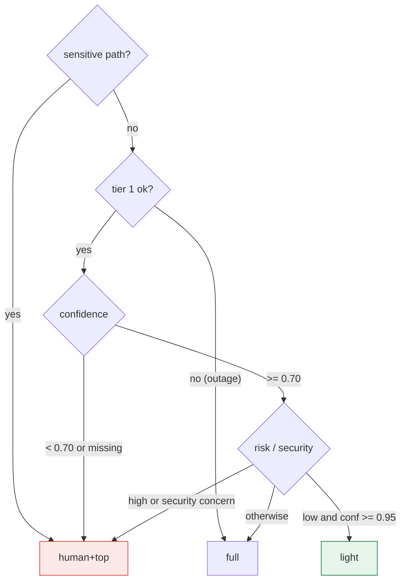
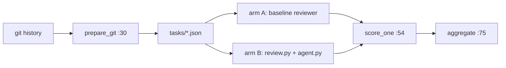

# Call Flow — how one review actually runs

Implementation walkthrough. Every reference is `file:line` against the 0.3.0 code.
For *why* it is built this way, see `architecture.md`; this document is *what calls
what*. If a line number here has drifted, the function name beside it is the anchor.

Numbers throughout are from a real run: `acme-orders` commit `a1b2c3d4e`, against a
23 MB graph (8031 nodes / 30573 edges). That run predates the tier-1 verdict stage,
so its token table has no verdict calls.

---

## The whole run in one picture



Three processes, four cost tiers. On the reference run `review.py` and `system1.py`
finished in **2.1 s**; `agent.py` took **3m06s**. That ratio is the design.

---

## Stage 1 — `review.py`: diff to bundles

```
python review.py --diff pr.diff --graph graph.json --repo . [--max-bundle 12]
                 [--no-system1] [--gate] [--overrides overrides.toml]
```

Exit 2 if the graph file is missing (`review.py:319-321`) or the tier-1 key is
missing (see 2a). `--gate` with `--no-system1` is rejected (`:323`). **0.3.0:**
`graph_freshness()` (`:87-103`) runs right after the graph loads and warns loudly
on stderr if the graph's `built_at_commit` stamp doesn't match the repo's HEAD —
previously a manual step in the skill, not enforced here at all (§8).

### 1a. Parse the diff — `diffparse.py`

`parse_hunks()` (`diffparse.py:56`) walks the unified diff and emits `Hunk` objects
(`diffparse.py:17`). It skips `/dev/null` targets (deleted files) and empty hunks.

| Property | Line | Note |
|---|---|---|
| `touched` | `:24` | New-file line numbers. A **deletion consumes no new line**, so it anchors where it was — a removed guard is flagged there. |
| `end` | `:38` | Last new-file line, counting only non-`-` lines. |
| `is_whitespace_only` | `:42` | Collapses whitespace runs **only on lines without quotes**; a line containing `"` or `'` is only stripped, because inside a string literal whitespace is content. |
| `text()` | `:52` | Renders the hunk with a `@@ path:start @@` header — this is what the reviewer reads. |

`norm()` (`diffparse.py:11`) strips `a/`/`b/` and normalises slashes. It is the one
path function shared by `review.py` and `bench.py`.

### 1b. Tier 0 — free, deterministic

`build()` (`review.py:228-234`):

```python
why = ("skip-glob" if hit(h.path, ov["skip"]) else
       "whitespace-only" if h.is_whitespace_only else None)
```

`hit()` (`:83`) is `fnmatch` against `overrides.toml`. `load_overrides()` (`:42`)
falls back to the copy shipped beside the script when the target repo has none —
otherwise empty globs would silently disable tier 0. **No model runs here.** Each
dropped hunk is reported with its `reason`. On the reference diff this resolved
**13 of 26 hunks (50%)**, almost all a 226-line `DESIGN.md`.

### 1c. Index the graph — one pass

`Graph.__init__` (`review.py:112-131`) builds, in a single walk over the edges:

| Index | Purpose |
|---|---|
| `by_id` | node lookup |
| `by_base` | basename → nodes, for the **suffix** path join |
| `fan_in` | incoming `calls`, **`EXTRACTED` only** (`:125`) |
| `callees` | outgoing `calls` |
| `incoming` | `calls` + `references`, used for test coverage |

Edges are read from `edges` **or** `links` (`:124`): clustered graphs use the former,
`graphify update --no-cluster` the latter. The `confidence != "EXTRACTED"` guard
(`:125`) is §9.4: inferred edges never become numbers.

**0.3.0:** two more methods live here — `sensitive_ids()` (`:156-157`) and
`hops_to_sensitive()` (`:159-186`), the bounded BFS behind the `path_to_sensitive`
fix (§9.3, see 1f).

### 1d. Map hunks to nodes

`Graph.nodes_for()` (`:137`) → `(nodes, precision)`:

- `in_file()` (`:133`) matches by **suffix**, because graph `source_file` points into a
  build-time staging copy that may no longer exist.
- Any node whose line falls inside the hunk → `precision: "line"`.
- Otherwise all nodes in the file → `precision: "file"`. 36% of nodes have no line
  number, and graph drift demotes the rest.
- No match → `"none"`, and the bundle gets `in_graph: false`.

### 1e. Build the facts

| Fact | Source | Where |
|---|---|---|
| `symbols[].callers` | graph `fan_in` | `build():264` |
| `symbols[].callees` | graph, first 8 | `build():265` |
| `entry_point_annotations` | **source scan, not the graph** | `entries()` `:189` |
| `covering_tests` | graph, **file level** | `tests_for()` `:144` |
| `path_to_sensitive_hops` | `Graph.hops_to_sensitive()` | computed `:272-273`, stored `:283`, **0.3.0** |

Only nodes whose label starts with `.` count as symbols (methods, §9.1).

**`callers` is `"unknown"` when fan-in is zero, never `0`** (`:264`). On the measured
service 66% of methods have no callers in the graph because CDI wires them; zero
means *unmeasured*, and reporting `0` would teach a risk model that entry points
are safe.

**`entries()` scans 40 lines above through the end of the hunk** with `ENTRY_RE`
(`:24`) — `@Path`, HTTP verbs, `@Observes*`, `@Scheduled`, `@ConsumeEvent`,
`@Incoming`, `@PostConstruct`, `@Startup`. It needs `--repo`; without it the list is
empty.

**`tests_for()` is file-level on purpose** — test→source edges land on the *class*
node (`FooIT -references-> Foo`), never the method node, so a per-symbol lookup
silently returns "no tests" for a well-covered class.

### 1f. Bundle and rank

`build()` (`:228-291`). Group by **package directory** (`:236-238`) — the graph ships no
community data, and for Java the package is the module boundary. Sort by
`(path, start)` (`:244`) so a file's hunks stay together, then chunk by `--max-bundle`
(default 12; each bundle is one agent paying its own cold cache write, so coarse beats
fine). `sensitive` is true if **any** hunk in the chunk matches a sensitive glob.

**0.3.0 — `path_to_sensitive`, fixed (§9.3):** `sens_ids = g.sensitive_ids(...)`
(`:241`) is computed once for the whole run, not per bundle. For a bundle that is
*not* itself sensitive, `g.hops_to_sensitive(sym_ids, sens_ids, ov["tests"])`
(`:272-273`) walks only directed `calls` edges, excludes test files, caps at 4
hops, and returns the hop count or `None`. The original `graphify path` walked all
relation types, undirected, through tests — this replaces it rather than calling it.

`rank()` (`:199`) produces a deterministic prior **and its basis** — now including
the path-to-sensitive bonus when `hops` is not `None` (`:222-223`):

```
sensitive path (+100); entry @ObservesAsync (+25);
4 symbol(s) unknown fan-in (+10); max fan-in 2 (+2);
no covering tests (+10); 6 hunk(s) (+6)   = 153
```

Bundles are sorted by `risk_hint` descending (`:291`). Output also carries
`stats` (`hunks_in_diff`, `hunks_dropped_free`, `bundles`, `sensitive_bundles`,
`unmapped_bundles`, `graph_freshness`) and the `dropped` list.

### 1g. Linters — opt-in, 0.3.0 (`review.py:368-370`)

With `--run-linters`, after tier 1 (if any) runs: `load_linters()` (`:47-51`) reads
`[[linters]]` from `overrides.toml`; `run_linters()` (`:54-80`) shells out to each
configured command, once, for the files its `glob` matches among the surviving
hunks' paths — never the whole repo. Each command's stdout must be a JSON array of
`{"path", "line", "severity", "message"}` — this project's own contract, not any one
vendor's. Results land in `res["lint_findings"]`, never go through either model, and
`agent.py` merges them into the final output directly (3f).

---

## Stage 2 — `system1.py`: tier-1 triage

Runs inside `review.py:337-366`, on by default. `--no-system1` opts out.



### 2a. Key resolution — `env_source()` (`system1.py:34`)

Order: process environment → `.env` beside `system1.py` → on Windows, the user
registry (`HKCU\Environment`, where `setx` writes; a shell started earlier never
inherits it, and the origin label says so). `env()` (`:50`) returns the value only.

**Failure modes, deliberately different** (`review.py:337-349`):

| Situation | Behaviour |
|---|---|
| Hosted default URL and no key — **misconfiguration** | Hard `exit 2` before any triage. |
| Custom `SYSTEM1_URL` (e.g. a self-hosted server) | No key required; the swap seam of §4.1. |
| Key present, endpoint down — **outage** | `triage()` returns `ok: false`; `route()` returns `full`. Never downgrades. |

### 2b. The payload — `features()` (`system1.py:146`)

Nine scalar fields, ~70 tokens. **No diff, no source.** Names and counts travel.

```python
{"change": "ImportEventOrchestrator.java, ... (6 hunks)",
 "package": "src/main/java/com/acme/orders/migration",
 "symbols": ".safeCache(), .receiveMessage(), ...",
 "entry_point": "@ObservesAsync",
 "max_callers": "2", "unknown_callers": 4,
 "covering_tests": 0, "sensitive_path": "yes", "found_in_graph": "yes"}
```

**`_no_source()` (`:166`) is a runtime guard, not a test.** Every field is a
single-line name or count, so a `@@` or an escaped newline in the serialised record
means diff text got in, and it raises `ValueError`. The same guard wraps the verdict
record (2f). This is what makes a closed external vendor acceptable against a
proprietary codebase.

### 2c. The request — `ask()` (`system1.py:175`)

```json
{"model": "jev-latest", "state": {...}, "questions": {...}}
```

URL is `SYSTEM1_URL` or `DEFAULT_URL`; model is `SYSTEM1_MODEL` or `jev-latest`;
`Authorization: Bearer` is added only when a key exists; timeout 20 s. `model` is
**required** by the hosted API (422 without it).

### 2d. The questions — `QUESTIONS` (`system1.py:62`)

Two `choice` questions: risk (`low|medium|high`) and security surface
(`none|authz|input|secrets`). `tests_missing` and `needs_deep_review` were dropped —
never pay a model for what tier 0 computed.

**Instruction quality is load-bearing, and this is measured.** Routing gates on
*confidence*; a vague instruction returns a low-confidence answer, which escalates
every bundle and silently cancels the tiering lever:

| Instructions | Tier-1 confidence, same record |
|---|---|
| One-line ("How risky is this change?") | **0.33** → escalate |
| With explicit disambiguation | **0.97** → routes `light` |

The disambiguation that mattered: *"Treat max_callers 'unknown' as UNMEASURED, never as
zero"*, and *"entry_point, not unknown_callers, is the authority on whether the runtime
invokes this code"*.

### 2e. Routing — `route()` (`system1.py:212`)

Evaluated top-down; **every absence of signal escalates**:



Real result on the reference diff (from the earlier tier-1 instructions) — note
**nothing reached `light`**:

| bundle | tier-1 risk | conf | security | route |
|---|---|---|---|---|
| b001 migration | high | 1.00 | input | `human+top` |
| b002 migration | high | 0.98 | input | `human+top` |
| b000 cache | low | **0.54** | none | `human+top` — below the 0.70 floor |
| b003 mutex | medium | 0.85 | none | `full` |

b000 is the design working: tier 1 said *low* but wasn't sure, so it escalated rather
than downgrading.

### 2f. The verdict — `verdict()` (`system1.py:128`)

Called later from `agent.py`, not from `review.py`. Builds a six-field record
(`severity_claimed`, `scope`, `reviewer_confidence`, `summary`, `failure`,
`sensitive_path`), each passed through `flat()` (`:122`, one line, 240 chars), checks
it with `_no_source()`, and asks `Q_VERDICT` (`:101`) for `block | fix | note`. It
**never raises**: an outage returns `{"ok": False, ...}` so the caller can fall back.

### 2g. Stats

`review.py:353-363` sums the triage calls into `stats.system1_usage`
(`calls`, `input_tokens`, `output_tokens`, `est_usd` at the published $0.042/1M rate,
`model`) and `stats.system1_ok` (`"4/4"`).

---

## Stage 3 — `agent.py`: Claude on the subscription

```
python agent.py --bundles bundles.json --repo . [--concurrency 4] [--timeout 600]
                [--cheap-model opus] [--no-verdict]
```

Exit 2 if `claude` is not on PATH (`:170`).

### 3a. One subprocess per bundle — `review()` (`agent.py:63`)

```python
payload = {k: bundle[k] for k in KEYS}
if hints := hints_for(bundle):
    payload["hints"] = hints
"claude", "-p", json.dumps(payload, indent=2),
"--agent", AGENT, "--model", model,
"--output-format", "json",
"--permission-mode", "dontAsk",
```

- **`claude -p` runs on the subscription**, not an API key. The only key in this
  system is `TYPESAFE_API_KEY`, and only for tier 1.
- **`--agent graph-reviewer`** loads `agents/graph-reviewer.md`, which carries the
  prompt *and* the `tools: Read` grant. The interactive skill uses the same
  definition, so both runtimes review identically.
- **`KEYS`** (`:29`) sends only `id, package, sensitive, facts, hunks`. `route` and
  the confidence value are **never** sent. **0.3.0:** `hints_for()` (`:32`) adds an
  optional `hints` array — only `risk` and `security_concern`, reframed as claims to
  verify, never as a conclusion system 2 inherits. Empty when tier 1 was down or
  skipped, so a missing `hints` key is not itself a signal.
- **`dontAsk`** — a permission prompt in a non-interactive run is a hang.
- **Model** (`:64`): `--cheap-model` if `route` is in `CHEAP_ROUTES = {"light"}`
  (`:27`), else `opus`. Default `--cheap-model` is `opus`, so the lever is inert.

**This is one call, not an agent loop.** `review.py` already resolved the facts, so
there is nothing for the model to discover. That is the cost thesis.

### 3b. Error handling (`agent.py:83-86`)

```python
body = json.loads(out.decode() or "{}") if out else {}
if proc.returncode != 0 or body.get("is_error"):
```

Claude Code reports failures as `is_error` in the JSON **on stdout**; stderr is usually
empty. Reading stderr alone loses the message. A timeout kills the process
(`:77-78`).

### 3c. Parsing — `findings_from()` (`agent.py:50`)

`--output-format json` wraps the reply. `re.search(r"\[.*\]", text, re.S)` tolerates a
code fence or surrounding prose. Each finding is tagged with its `bundle` id (`:97`),
which is how the verdict step later finds whether the bundle was sensitive.

### 3d. Concurrency — `run()` (`agent.py:101`)

`asyncio.Semaphore` caps in-flight subprocesses; `gather` fans out. `one()` swallows
per-bundle exceptions, prints them to stderr and returns `[], {}` — **one bundle must
not sink the run**. The consequence: a failed bundle yields zero findings and no
exit-code signal beyond its stderr line.

### 3e. Ordering (`agent.py:220-222`)

Findings sort by: introduced before `pre_existing`, then `blocker > should_fix >
nitpick`, then higher `confidence` first.

### 3f. The verdict — `adjudicate()` (`agent.py:144`)

For each finding, `system1.verdict()` is called. It is accepted only if
`ok` **and** `confidence >= 0.70` **and** the choice is one of `block|fix|note`
(`:155-156`). Otherwise `FALLBACK` (`:126`) maps the reviewer's own severity:
`blocker→block`, `should_fix→fix`, `nitpick→note`. `verdict_by` records which
(`system1` or `fallback:<reason>`).

Then a **deterministic clamp** (`:161`): `scope == "pre_existing"` and `block` →
`note`. A defect this diff did not introduce cannot gate its merge, whatever tier 1
says.

`--no-verdict` (`:223-230`) applies the same `FALLBACK` and clamp without calling
tier 1. `test_agent.py` pins this path.

**0.3.0:** lint findings (`lint_findings_from()`, `:132-141`) bypass both this step
and system 2 entirely — they already carry a verdict from `LINT_VERDICT`
(error→fix, warning/info→note) before they ever reach `main()`'s sort.

### 3g. Exit code — `agent.py:253`

```python
return 1 if blockers or sensitive else 0
```

`blockers` counts `verdict == "block"` across all findings; `sensitive` counts
sensitive **bundles**. Non-zero fails CI on either, so a sensitive path always needs
a human even with zero findings.

---

## Token accounting — `accounting()` (`agent.py:168`)

Printed to stderr as JSON. Tier-1 triage totals come from `stats.system1_usage`
(summed in `review.py`), plus `verdict_calls` and `verdict_tokens` from the
adjudication pass. Claude's totals are summed from each subprocess result, with
`models` counted per call, `cache_read_tokens`, `cache_write_tokens`, `notional_usd`
and `wall_ms` (the slowest single bundle, not the sum).

Measured on the reference diff (before the verdict stage existed):

| | calls | input | output | cache read | cost |
|---|---|---|---|---|---|
| **system 1 — triage** | 4 | 2,964 | 360 | — | **$0.00014** billed |
| **system 2 — Claude** | 4 | 32 | 35,633 | 253,890 | $1.92 *notional* |

- **Tier 1 costs 0.007% of Claude.** The triage economics as a measurement.
- **`notional_usd` is not a bill.** Claude Code reports an API-equivalent figure even
  on a subscription; it is only useful for comparing arms.
- 253,890 cache-read tokens against 32 input tokens means prompt caching on the agent
  definition carries nearly the whole prompt.

---

## Where `bench.py` attaches

`bench.py` never invokes either arm — it prepares tasks and grades answers, so it
stays neutral and runs without Claude or the tier-1 vendor. **0.3.0:** the
Defects4J-backed `prepare` / `prepare_bug()` path was cut — it was always the
supplementary arm (§10.1), `prepare-git` was already primary, and nothing else in
this repo depended on it. `setup-defects4j.sh` is gone with it.



- `prepare_git()` diffs `sha..sha~1` over `*.java` — the "PR" re-introduces the bug
  a real fix commit fixed, with no triggering test (weaker than an executable
  benchmark, but it runs against your own history with no download).
- `score_one()` takes `--tolerance` (default 5) and reports `rank_of_first_hit`,
  because reviews are read top-down.
- A **missing findings file counts as a miss**, never a skip (`bench.py:142-148`).

---

## Full command sequence

```bash
# once: keep the graph current (local AST parse, no tokens)
graphify update . && graphify hook install

# per review
git diff origin/main...HEAD > pr.diff
python review.py --diff pr.diff --graph graphify-out/graph.json --repo . > bundles.json
python agent.py --bundles bundles.json --repo . > findings.json
echo $?        # 1 = a block verdict, or any sensitive bundle
```

Interactively, `/graph-review` runs the same stages inside Claude Code. `ensure.py`
checks the machine first (`--deep` also probes the tier-1 endpoint and Claude auth).
